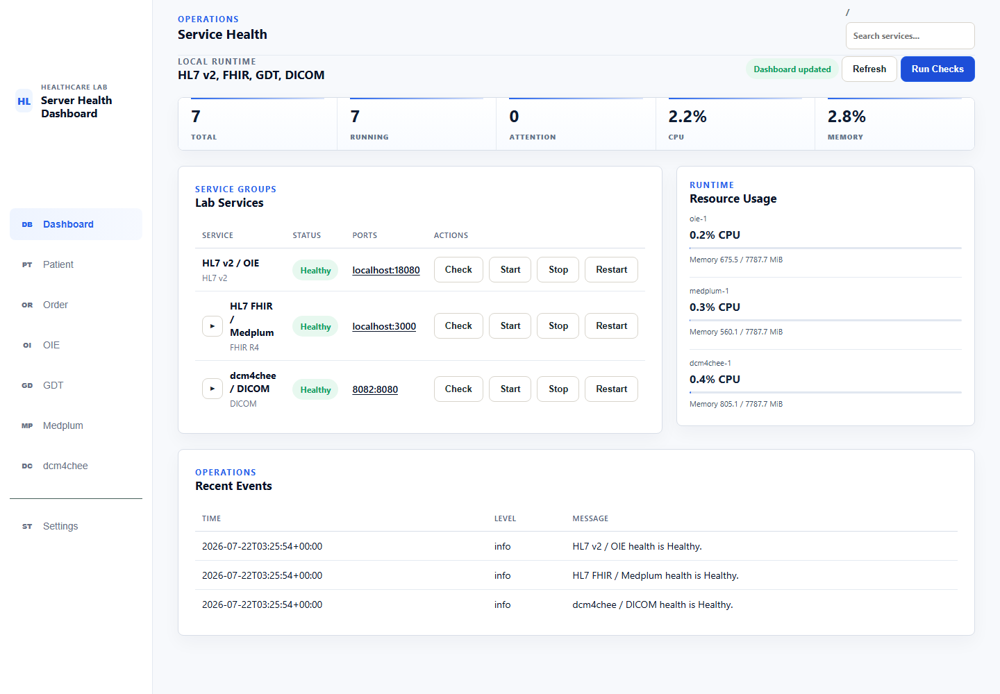
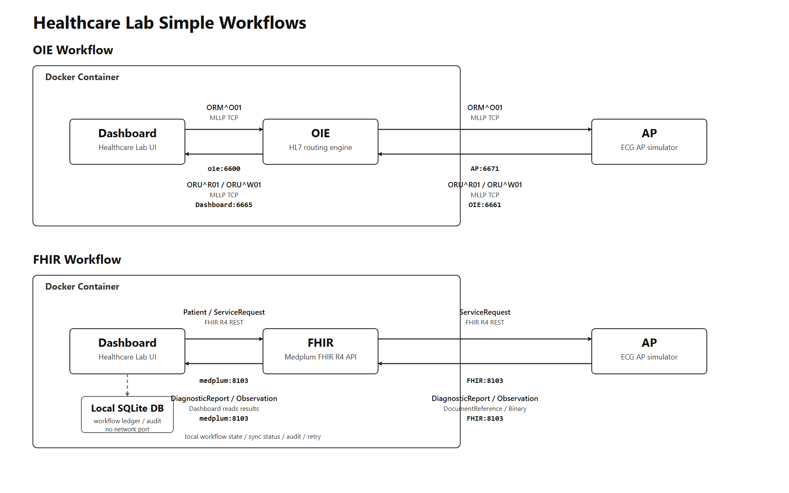
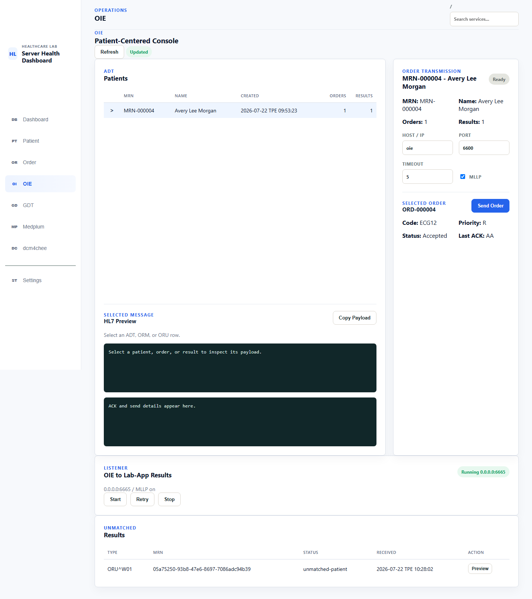
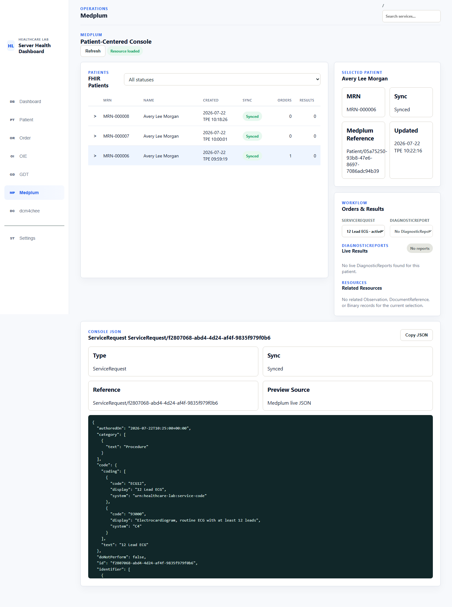

# Healthcare Lab

> Run end-to-end HL7 v2, FHIR R4, GDT, and DICOM workflows locally with Docker.

[](https://github.com/Tzu-Huang/healthcare-lab/actions/workflows/container-image.yml)
[](https://github.com/Tzu-Huang/healthcare-lab/releases/latest)
[](https://github.com/Tzu-Huang/healthcare-lab/pkgs/container/healthcare-lab)
[](deploy/README.md)

[Quick Start](#quick-start-with-docker) ·
[Demo](docs/demo-walkthrough.md) ·
[Architecture](docs/architecture.md) ·
[English Handbook](docs/handbook/USER_HANDBOOK.en.md) ·
[中文手冊](docs/handbook/USER_HANDBOOK.zh-TW.md)



Healthcare Lab is a browser-based interoperability workbench that connects
**Open Integration Engine (OIE)**, **Medplum**, **dcm4chee**, and a **GDT
Bridge** behind one local control plane. Use synthetic data to exercise the
same patient, order, and result boundaries that are normally scattered across
separate hospital systems.

| Start with a virtual patient | Follow the order | Reconcile the result |
| --- | --- | --- |
| Create protocol-specific patient records and inspect their identifiers. | Send HL7 `ORM^O01`, create a FHIR `ServiceRequest`, export GDT `6302`, or create a DICOM MWL item. | Inspect ACKs, import GDT `6310`, discover FHIR or DICOM results, and match them to the original context. |

### What you can demonstrate

- Create a virtual Patient without connecting to a real hospital system.
- Route HL7 v2 orders and results through OIE over MLLP.
- Synchronize FHIR R4 `Patient` and `ServiceRequest` resources to Medplum.
- Create DICOM patient and modality worklist records in dcm4chee.
- Exchange GDT 2.1 order/result files and reconcile ECG results across protocols.

> [!IMPORTANT]
> Use virtual data only. Healthcare Lab is a trusted local/internal test
> environment, not a regulated clinical system, and must not be exposed
> directly to the public Internet.

## Workflow at a Glance



<table>
  <tr>
    <td width="50%"></td>
    <td width="50%"></td>
  </tr>
  <tr>
    <td align="center"><strong>HL7 v2 through OIE</strong></td>
    <td align="center"><strong>FHIR R4 in Medplum</strong></td>
  </tr>
</table>

## What It Supports

### HL7 v2 / OIE

- Create local Patients and ECG Orders with HL7 v2.5.1 ADT and ORM payloads.
- Send selected `ORM^O01` messages to OIE over MLLP and retain ACK or transport
  outcomes.
- Manage the Healthcare Lab OIE channel definitions and inspect runtime
  diagnostics.
- Automatically listen for routed ORU results and reconcile them with the local
  patient and order context.

### FHIR R4 / Medplum

- Create Patients locally, then synchronize them to Medplum with retry and
  deterministic identifier matching.
- Create ECG orders as FHIR `ServiceRequest` resources.
- Inspect Patient-centered `Patient`, `ServiceRequest`, `DiagnosticReport`,
  `Observation`, and `DocumentReference` data.
- Retain local sync state, request/response metadata, Medplum references, and
  `OperationOutcome` details without replacing Medplum as the source of truth.

### GDT 2.1

- Export patient and order context as a GDT `6302` file.
- Exchange files through configurable `inbox/` and `outbox/` bridge folders.
- Import and reconcile GDT `6310` results, including referenced PDF or DICOM
  artifacts.
- Optionally source OpenEMR procedure orders from an external MariaDB database.

### DICOM / dcm4chee

- Synchronize DICOM Patient master data to dcm4chee using HL7 `ADT^A04`.
- Create and verify modality worklist items through DICOMweb MWL endpoints.
- Keep stable Patient ID, issuer, accession number, requested procedure,
  scheduled procedure step, and Study Instance UID mappings in the local ledger.
- Discover studies through QIDO-RS and reconcile returned DICOM results with
  local Patients and Orders.

## Application Pages

- **Dashboard** — managed service health, configuration, logs, smoke checks,
  and supported lifecycle operations.
- **Patient** — create and inspect protocol-specific patient records and refresh
  patient results.
- **Order** — create ECG orders for an existing local Patient.
- **OIE** — review HL7 inventory, send ORM messages, manage channels, and inspect
  listener diagnostics.
- **Medplum** — browse supported FHIR resources and retry pending or failed sync.
- **GDT** — configure the shared-folder bridge, export `6302`, and import `6310`.
- **dcm4chee** — inspect connection settings, MWL mappings, verification, and
  DICOM result metadata.
- **Settings** — edit service and protocol connection profiles.

## Architecture

The application follows a layered, protocol-oriented structure:

```text
frontend/                   Browser templates, styles, views, API and state modules
backend/api/                HTTP boundary and response mapping
backend/services/           Workflow orchestration and coordination
backend/domain/             Protocol-neutral and protocol-specific domain rules
backend/mappers/            HL7, FHIR, GDT and DICOM transformations
backend/clients/            External service transports
backend/repositories/       SQLite workflow ledgers and persistence
backend/runtime/            Background OIE result and GDT bridge listeners
deploy/                     Supported Docker Compose runtime and CLI
```

Dependencies point inward: API and runtime adapters call services; services use
domain models and explicit client/repository ports. See
[Architecture and boundaries](docs/architecture.md) and
[Project boundary](PROJECT_BOUNDARY.md) for the detailed ownership rules.

## Quick Start with Docker

Docker Compose is the supported end-user installation path. The release is
verified with `linux/amd64` containers on Docker Desktop for Windows in Linux
container mode. An equivalent Linux Docker host is expected to work but is
still pending formal release verification.

For the verified path, install and start Docker Desktop, use Windows PowerShell
5.1 or newer, and download the GitHub Release source archive. The first start
pulls the OIE, Medplum, dcm4chee, and Healthcare Lab images, so completion time
depends on the network and Docker resources.

```powershell
.\deploy\lab.ps1 start
.\deploy\lab.ps1 status
```

No `.env` or YAML edit is required. Open Healthcare Lab at
<http://127.0.0.1:5000>. If required application settings are incomplete, the
Dashboard provides a guided action into the owning Settings section. Starting
the containers proves the runtime is available; complete the relevant Settings
checks before expecting an end-to-end protocol workflow to pass.

The Compose stack pulls `ghcr.io/tzu-huang/healthcare-lab:1.2.0` by default, so
the host does not need Python or a source-code mount. Useful operational
commands are also available through the PowerShell wrapper:

```powershell
.\deploy\lab.ps1 status
.\deploy\lab.ps1 smoke all
.\deploy\lab.ps1 logs lab-app -Lines 200
.\deploy\lab.ps1 restart lab-app
.\deploy\lab.ps1 stop all
```

See [Deployment runtime](deploy/README.md) for configuration, persistence,
service-specific operations, troubleshooting, backup, and endpoint migration.

> `lab-app` mounts `/var/run/docker.sock` so the Dashboard can inspect and
> control lab containers. Access to that socket is effectively Docker host
> administration. Only run this stack in a trusted environment and use virtual
> patient data.

## Default Endpoints

| Service or flow | Host endpoint | Container endpoint |
| --- | --- | --- |
| Healthcare Lab | `http://127.0.0.1:5000` | `lab-app:5000` |
| OIE management HTTP | `http://127.0.0.1:8080` | `oie:8080` |
| Healthcare Lab order to OIE | `127.0.0.1:6600` | `oie:6600` |
| AP result ingress to OIE | `127.0.0.1:6661` | `oie:6661` |
| OIE result to Healthcare Lab | not published by default | `lab-app:6665` |
| Medplum API / FHIR | `http://127.0.0.1:8103` | `medplum:8103` |
| Medplum web app | `http://127.0.0.1:3000` | `medplum-app:3000` |
| dcm4chee web UI | `http://127.0.0.1:8082` | `dcm4chee:8080` |
| dcm4chee DIMSE | `127.0.0.1:11112` | `dcm4chee:11112` |
| dcm4chee HL7 receiver | `127.0.0.1:2575` | `dcm4chee:2575` |

Published ports can be overridden with an optional `.env` copied from
`.env.example`. Docker-internal integrations continue to use service names and
container ports rather than host loopback addresses.

For dcm4chee, only the browser-facing `DCM4CHEE_WEB_UI_URL` uses the published
host port. DIMSE, HL7, and DICOMweb settings used by lab-app must keep the
`dcm4chee` service name and container ports in the Compose deployment.

## Configuration

Use the Settings UI for application connections, credentials, protocol
identities, timeouts, and runtime behavior. Typed profiles persist in the
`lab-app-instance` volume and remain authoritative after container recreation.

`.env.example` is an optional **Advanced deployment** template for immutable
image selection, host-published ports, the GDT host bind, service database
credentials/security hardening, and startup policy. Existing installations may
keep eligible legacy application values for one startup: Compose passes only a
fixed allowlist, missing typed profiles are seeded once, and persisted Settings
are never overwritten by later environment changes.

Keep deployment secrets in the untracked `.env` or an approved secret store.
Application secrets entered in Settings are never written back to `.env`,
Compose, browser storage, command output, or generated diagnostics. Local
defaults do not provide production TLS, authentication, or authorization.

## Local Development

Python 3.10 or newer is required for direct host development:

```powershell
python -m venv .venv
.\.venv\Scripts\Activate.ps1
python -m pip install -r requirements.txt
python app.py
```

The development server binds to `127.0.0.1:5000` by default. Override
`LAB_APP_HOST`, `LAB_APP_PORT`, or `HEALTHCARE_LAB_DB` when needed. Runtime data
is otherwise stored in `instance/healthcare-lab.db`.

When running `python app.py` directly on the host while dcm4chee remains in
Docker, set
`DCM4CHEE_DIMSE_HOST=127.0.0.1` and `DCM4CHEE_HL7_HOST=127.0.0.1`, then replace
`http://dcm4chee:8080` with `http://127.0.0.1:8082` in the DICOMweb URLs.

Run the automated suite with:

```powershell
python -m unittest discover -s tests -v
```

## Documentation

- [User handbook — Traditional Chinese](docs/handbook/USER_HANDBOOK.zh-TW.md)
- [User handbook — English](docs/handbook/USER_HANDBOOK.en.md)
- [Deployment runtime](deploy/README.md)
- [Container release and operations](docs/container-release.md)
- [Architecture and boundaries](docs/architecture.md)
- [OIE live verification runbook](docs/oie-live-verification-runbook.md)
- [dcm4chee end-to-end verification](docs/dcm4chee-production-e2e-verification.md)
- [GDT bridge MVP](docs/gdt-bridge-mvp.md)
- [Mirth Connect / OIE setup](docs/mirth-connect-setup.md)
- [Release notes: v1.1.2](docs/releases/v1.1.2.md)

## Scope and Limitations

- Virtual lab data only; do not use production patient information.
- SQLite is a single-instance workflow ledger, not a production message queue.
- The supported release platform is `linux/amd64`; ARM and multi-replica
  deployment are outside the verified matrix.
- OIE, FHIR, GDT, and DICOM workflows implement scoped interoperability lab
  profiles, not complete protocol or clinical-system conformance.
- Public-Internet hardening, built-in TLS, user authentication, authorization,
  and regulated audit controls are outside the project scope.
