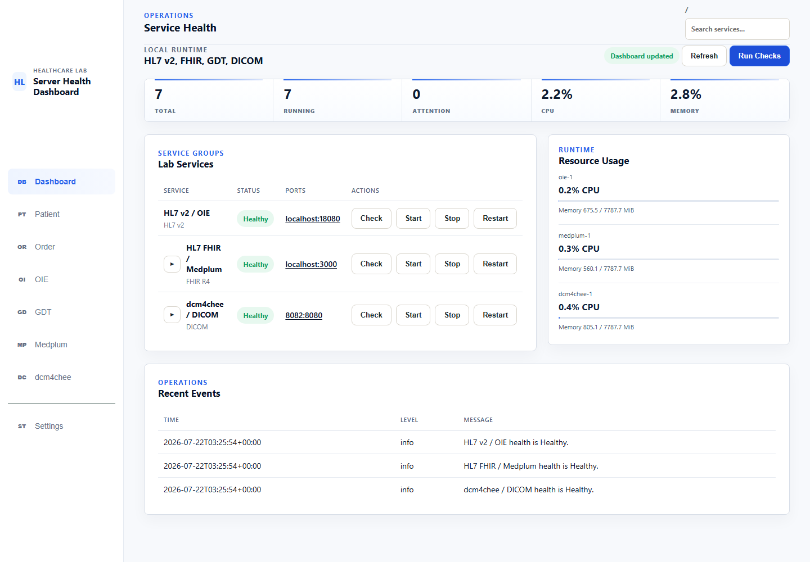
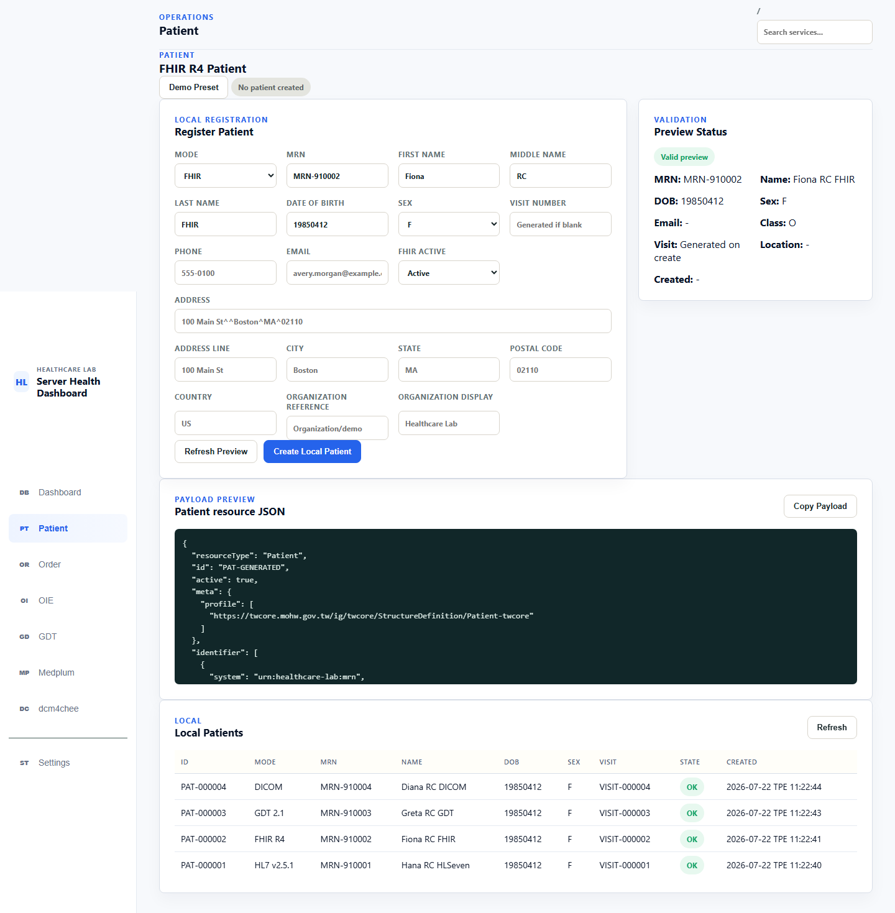
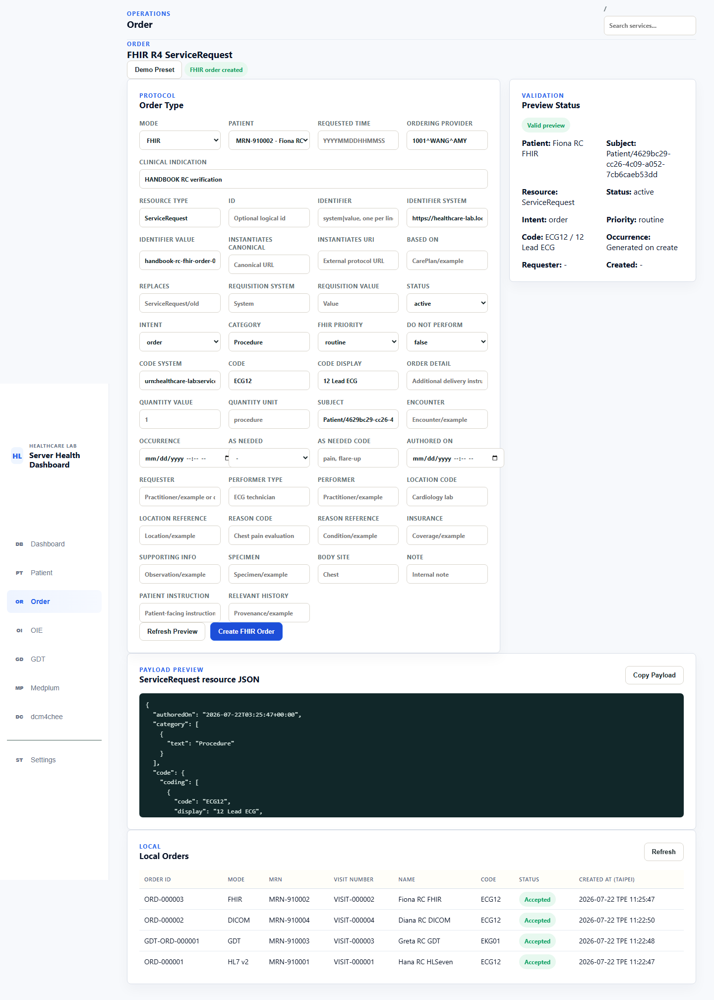
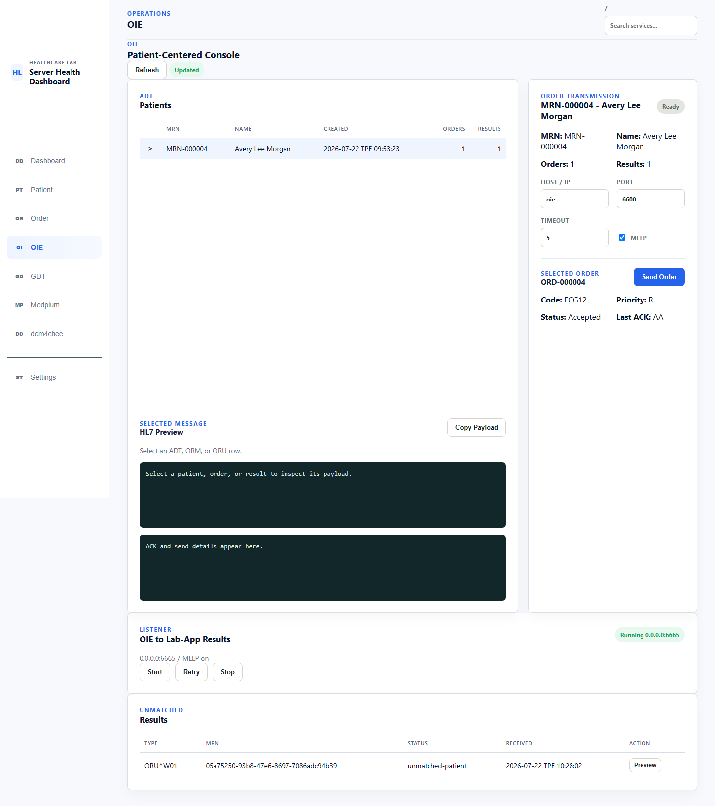
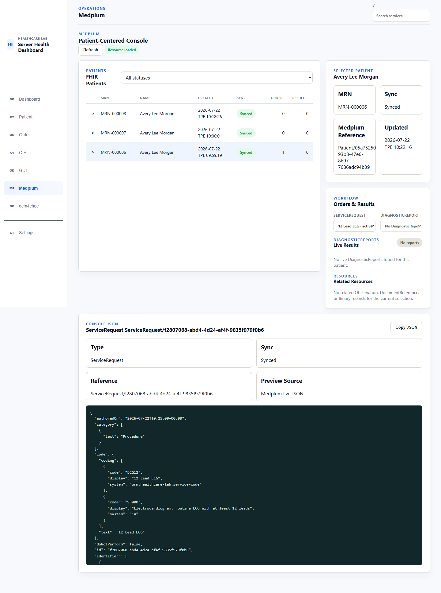
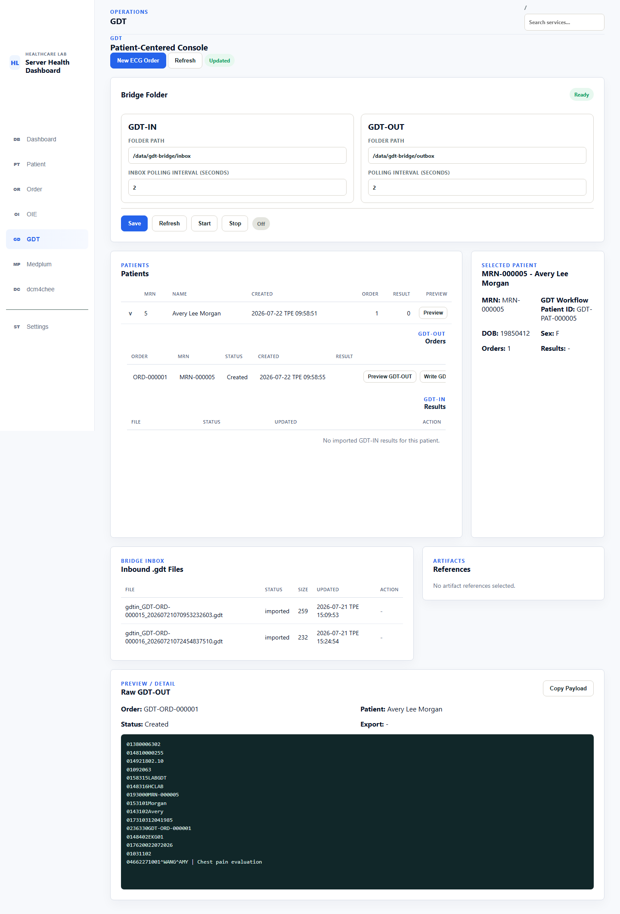
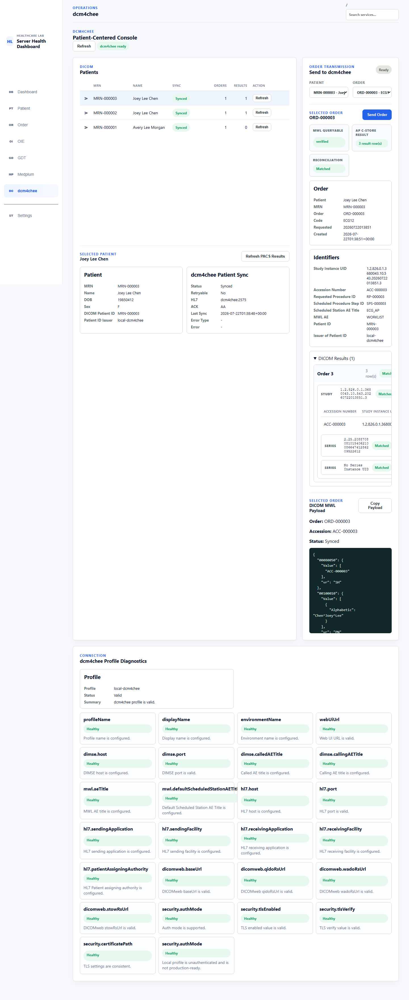

# Healthcare Lab 使用手冊（繁體中文）

> 文件狀態：v1.0.0 Release Candidate 初稿<br>
> 文件基準：`fd0e38f`<br>
> 最後更新：2026-07-22<br>
> 本版尚未通過正式發布、乾淨環境安裝及四協定完整端到端驗證。標有「待 RC 驗證」的內容不得視為正式操作保證。

## 第一部分：認識與啟動 Healthcare Lab

<a id="chapter-1"></a>
## 第 1 章　關於本手冊

本手冊協助 Healthcare Lab 操作人員安裝、設定、啟停、驗證及排除系統問題，並完成 HL7 v2、FHIR R4、GDT 2.1 與 DICOM/dcm4chee 的 ECG 訂單與結果流程。

適用讀者包括 healthcare integration tester、應用專員、醫療資訊工程師、系統操作員與展示操作人員。讀者不需要理解程式碼。

本手冊適用於 v1.0.0 RC Docker 發布模型，不包含原始碼建置或開發環境。第一次安裝請依序閱讀第 3～6 章；日常 UI 操作可從第 7～9 章開始；特定協定請直接閱讀第 10～13 章；故障處理請先看第 14 章。

<a id="chapter-2"></a>
## 第 2 章　Healthcare Lab 概觀

Healthcare Lab 是本機或內部測試環境使用的醫療整合操作平台。典型流程如下：

```text
建立 Patient
  -> 建立 ECG Order
  -> 傳送、同步或匯出 Order
  -> AP (QHAP) 處理 Order
  -> 回傳、匯入或核對 Result
  -> 檢查狀態、結果與操作紀錄
```

主要元件：Healthcare Lab UI 與 backend 管理本地工作流程；OIE 路由 HL7 v2；Medplum 儲存與查詢 FHIR R4 resources；GDT Bridge 透過共享資料夾交換檔案；dcm4chee 提供 MWL、DICOM archive 與 DICOMweb；AP (QHAP) 取得訂單並回傳結果。

側邊欄的主要頁面為 Dashboard、Patient、Order、OIE、GDT、Medplum 與 dcm4chee。這些名稱符合 2026-07-22 recorded RC browser pass；尚未驗證的 actions 與 limitations 會在相關章節明確標示。

### 系統架構

```text
Browser -> Healthcare Lab (lab-app:5000)
              |-> OIE (HL7 v2 / MLLP)
              |-> Medplum (FHIR R4 / OAuth)
              |-> GDT Bridge shared folder
              `-> dcm4chee (HL7 ADT, MWL, QIDO/WADO)

AP (QHAP) <-> OIE / GDT shared folder / dcm4chee
```

> 待 RC 驗證：以最終部署拓撲圖取代文字圖，並核對每條連線、方向、協定及 port。

<a id="chapter-3"></a>
## 第 3 章　安裝前準備

v1.0.0 RC 的支援邊界是可信任的本機或內部實驗室，以及 `linux/amd64` containers。Windows 使用 Docker Desktop 的 Linux container mode；等效 Linux Docker host 仍待正式發布驗證。

### 已驗證的 RC 主機環境

2026-07-22 已在下列環境驗證 RC `lab-app` 可啟動、通過 Docker health check 並回傳 HTTP 200。這是已測試環境，不代表最低需求。

| 項目 | 已驗證值 |
| --- | --- |
| Host OS | Windows 11 64-bit |
| Host hardware | 16 logical CPUs、約 16 GB RAM |
| PowerShell | Windows PowerShell 5.1 |
| Docker Desktop | 4.75.0 |
| Docker Engine | 29.5.2，Linux/amd64 |
| Docker Compose | v5.1.3 |
| Docker VM resources | 16 CPUs、約 8 GB RAM |
| RC image | `healthcare-lab:verify-fd0e38f` |

### 安裝前檢查

執行：

```powershell
docker version
docker compose version
docker info --format 'Server={{.ServerVersion}} OSType={{.OSType}} Arch={{.Architecture}} CPUs={{.NCPU}} Memory={{.MemTotal}}'
```

確認 Docker Server 存在、`OSType=linux`，且 architecture 是 `x86_64`/`amd64`。只有 Docker Client 資訊、沒有 Server 資訊時，請先啟動 Docker Desktop 或確認目前 Docker context 與 daemon 權限。

開始安裝前另確認：

- 可連線至 GHCR 及第三方 image registries。
- 預設 host ports 5000、6600、6661、8080、8443、8103、3000、8082、11112、2575 未被其他程式占用。
- 需要 FHIR sync 時，已取得 Medplum OAuth client ID 與 secret。
- 已準備 GDT host folder；若使用外部 AP (QHAP)，已確認 Docker host IP、firewall 與必要 endpoints。
- 僅使用虛擬測試資料。

> 待 RC 驗證：最低 CPU、記憶體與磁碟需求、支援的瀏覽器版本，以及等效 Linux host 的乾淨安裝。

<a id="chapter-4"></a>
## 第 4 章　安裝已發布的 Docker Image

正式發布模型由固定版本的 Healthcare Lab image、versioned deployment bundle 與相容的 OIE、Medplum、dcm4chee images 組成。`.env` 屬於 deployment bundle，用來保存特定環境的 image tags、ports、service addresses、credentials 與 volume paths；它不在 immutable image 內。

### RC 安裝程序

1. 下載並解壓縮 v1.0.0 deployment bundle。
2. 在 bundle 根目錄開啟 PowerShell。
3. 建立本機設定與 GDT folders：

   ```powershell
   Copy-Item .env.example .env
   New-Item -ItemType Directory -Force instance\gdt-bridge\inbox
   New-Item -ItemType Directory -Force instance\gdt-bridge\outbox
   ```

4. 驗證 Compose 語法與實際 image matrix：

   ```powershell
   docker compose --env-file .env -f deploy\docker-compose.yml config --quiet
   docker compose --env-file .env -f deploy\docker-compose.yml config --images
   ```

   `config --quiet` 應以 exit code 0 結束。`config --images` 應顯示固定的 Healthcare Lab `1.0.0` image 與 release 文件所列的 third-party digests。

5. 檢查 `.env`，填入本環境需要的 credentials、ports 與 paths。啟動 Compose 前，必須將 `.env.example` 複製來的 dcm4chee host-facing connection values 改為 `lab-app` 可用的 Docker-network addresses：

   ```dotenv
   DCM4CHEE_DIMSE_HOST=dcm4chee
   DCM4CHEE_HL7_HOST=dcm4chee
   DCM4CHEE_DICOMWEB_BASE_URL=http://dcm4chee:8080/dcm4chee-arc/aets/WORKLIST/rs
   DCM4CHEE_QIDO_RS_URL=http://dcm4chee:8080/dcm4chee-arc/aets/DCM4CHEE/rs
   DCM4CHEE_WADO_RS_URL=http://dcm4chee:8080/dcm4chee-arc/aets/DCM4CHEE/rs
   DCM4CHEE_STOW_RS_URL=http://dcm4chee:8080/dcm4chee-arc/aets/DCM4CHEE/rs
   ```

   `DCM4CHEE_WEB_UI_URL` 應維持 host-facing，因為它由 browser 開啟；相對地，Compose 將 `.env` 注入 container 後，上述六個 backend values 中的 `127.0.0.1` 會指回 `lab-app` 本身。Deployment template 必須修正並重新完成 clean-install verification，才能從安裝程序移除這項 workaround。
6. 正式 image 發布後，拉取固定版本：

   ```powershell
   docker pull ghcr.io/tzu-huang/healthcare-lab:1.0.0
   ```

7. 啟動服務並檢查狀態：

   ```powershell
   docker compose --env-file .env -f deploy\docker-compose.yml up -d
   docker compose --env-file .env -f deploy\docker-compose.yml ps
   Invoke-WebRequest http://127.0.0.1:5000/ -UseBasicParsing
   ```

   `dcm4chee-storage-init` 是一次性初始化 service：它會先建立 configured archive storage directory，將目錄設為 `wildfly:wildfly`、權限 `0775`，成功後才允許 `dcm4chee` 啟動。`docker compose ps -a` 顯示它為 `Exited (0)` 是正常狀態；非零 exit code 才代表 archive storage 初始化失敗。

預期首頁回傳 HTTP 200，必要 containers 為 running/healthy。再執行下列命令確認實際 image，不可只看 container 名稱：

```powershell
.\deploy\lab.ps1 inspect lab-app
docker compose --env-file .env -f deploy\docker-compose.yml config --images
```

`inspect` 的 `Image` 必須是本次安裝指定的 Healthcare Lab immutable tag。Container health 不代表協定端到端流程已成功。

### 已完成的 RC image 驗證

本輪已使用隔離 Compose project 驗證 `healthcare-lab:verify-fd0e38f`：container 達到 `healthy`、首頁 HTTP 200、Gunicorn 在 container port 5000 啟動、force recreate 後 `/app/instance` marker 仍存在。Container release contract tests 共 7 項通過。

這項結果驗證 RC image 行為，但不等同正式 `ghcr.io/tzu-huang/healthcare-lab:1.0.0` 的 public pull 或完整 stack clean install。

> 待 RC 驗證：`v1.0.0` tag、public unauthenticated pull、image digest、乾淨環境安裝及第一次初始化。

<a id="chapter-5"></a>
## 第 5 章　設定

設定可能來自 `.env`、Compose、Dashboard 中保存的 server inventory，以及外部系統。若值衝突，實際工作流程可能使用 persisted server inventory；例如 Medplum sync 使用保存的 Medplum `baseUrl`，不應假設瀏覽器 URL 或 `.env` public URL 一定是 backend 使用的位址。

重要位址差異：

| 使用位置 | 範例 | 用途 |
| --- | --- | --- |
| Browser/host | `http://127.0.0.1:5000` | 操作 Healthcare Lab UI |
| Docker service | `http://medplum:8103/fhir/R4` | `lab-app` container 存取 Medplum |
| External device | `<Docker-host-IP>:6661` | AP (QHAP) 將結果送入 OIE |

變更 `.env` 後通常需 recreate 對應 service。可使用 `.\deploy\lab.ps1 restart <service>`；這個 wrapper 的 `restart` 會執行 `up -d --force-recreate`，不是單純的 process restart。Managed Channel destination、queue、retry 或 ACK 設定變更後，必須 Preview、Apply 並重新 deploy Channel。

在套用設定前，先執行：

```powershell
docker compose --env-file .env -f deploy\docker-compose.yml config --quiet
```

此命令會驗證 Compose 是否可展開，但不會驗證 credentials、network connectivity 或 protocol workflow。

機密資料只放在本機 `.env` 或受控 secret store，不可寫入文件、截圖或版本控制。

<a id="chapter-6"></a>
## 第 6 章　啟動、停止與驗證

從 deployment bundle 根目錄執行：

```powershell
.\deploy\lab.ps1 inspect lab-app
.\deploy\lab.ps1 status
.\deploy\lab.ps1 start all
.\deploy\lab.ps1 smoke all
.\deploy\lab.ps1 logs oie -Lines 200
.\deploy\lab.ps1 restart lab-app
.\deploy\lab.ps1 stop all
```

| Action | 實際用途 |
| --- | --- |
| `inspect` | 以 JSON 顯示 container、image、state、ports 與 Compose metadata |
| `status` | 執行 `docker compose ps`，列出目前執行中的 services |
| `start` | 執行 `docker compose up -d`；可指定 service |
| `smoke` | 目前只列出 Compose `ps` 狀態；不執行 HTTP 或協定測試 |
| `logs` | 顯示指定 service 的最後 N 行 logs |
| `restart` | force recreate service；指定 service 時使用 `--no-deps` |
| `stop` | 停止指定 service 或完整 stack，不移除 named volumes |

`gdt-bridge`、`hl7tester` 與 `gdt-hospital` 是 wrapper 中對應到 `lab-app` container 的 logical service names。`medplum` 同時對應 Medplum API 與 Web UI。

介面預設位置：Healthcare Lab `http://127.0.0.1:5000`、OIE HTTP `http://127.0.0.1:8080`、Medplum UI `http://127.0.0.1:3000`、dcm4chee UI `http://127.0.0.1:8082/dcm4chee-arc/ui2`。

### Ready-for-use 驗證

1. 執行 `.\deploy\lab.ps1 inspect lab-app`，確認 image tag、state、ports 與 restart count。
2. 執行 `.\deploy\lab.ps1 status`，確認預期 services 已列出。
3. 執行 `Invoke-WebRequest http://127.0.0.1:5000/ -UseBasicParsing`，確認 HTTP 200。
4. 開啟所需的 OIE、Medplum 與 dcm4chee interfaces。
5. 執行實際 service connectivity check。
6. 依第 10～13 章執行需要的 protocol workflow。

驗證分四層：container running、service health、service-to-service connectivity、完整 workflow。只有最後一層能證明 Patient、Order 與 Result 流程完成。現行 `.\deploy\lab.ps1 smoke all` 僅屬第一層狀態列舉。

### 啟動失敗時

- Docker command 只有 Client、沒有 Server：啟動 Docker Desktop並確認 context。
- Port 已被占用：停止衝突服務或在 `.env` 改用未占用的 host port，再 recreate 對應 service。
- `lab-app` 未達 healthy：查看 `.\deploy\lab.ps1 logs lab-app -Lines 200`，並確認 image、volume 與 `.env`。
- Container 使用錯誤 image：比較 `inspect lab-app` 與 `config --images`；修正 `LAB_APP_IMAGE` 後 recreate `lab-app`。
- Container healthy 但 workflow 失敗：繼續檢查 network、authentication、protocol response 與 identifier matching，不要反覆重裝。

## 第二部分：使用核心頁面

<a id="chapter-7"></a>
## 第 7 章　Dashboard

Dashboard 是啟動後的預設頁面，標題為 `Server Health Dashboard`。它顯示 container runtime 摘要、三個主要 service groups、resource usage 與 recent events。



### 頁面區域

- 頂部摘要：`TOTAL`、`RUNNING`、`ATTENTION`、`CPU`、`MEMORY`。
- `Lab Services`：HL7 v2/OIE、HL7 FHIR/Medplum、dcm4chee/DICOM。
- 每個 group 顯示 protocol status、主要 host port，以及 `Check`、`Start`、`Stop`、`Restart`。
- 可展開的 groups 會顯示 child services，例如 Medplum database/cache。
- `Resource Usage` 顯示主要 containers 的 CPU 與 memory。
- `Recent Events` 顯示最近的 health-check results。

### 執行 health checks

1. 開啟 `Dashboard`。
2. 選擇 `Run Checks` 檢查所有 groups，或選擇單一 group 的 `Check`。
3. 等待 `Dashboard updated`。
4. 檢查每個 group 的 status 與 `Recent Events`。

隔離 RC 實測中，初始 protocol statuses 為 `Unknown`；`Run Checks` 後，OIE、Medplum 與 dcm4chee 均通過 application、process 與 protocol checks，畫面轉為 `Healthy`。`7 RUNNING` 本身不會自動把 protocol status 從 `Unknown` 變為 `Healthy`。

### 啟停操作

`Start`、`Stop`、`Restart` 會操作實際 Compose services，而不是只改變 Dashboard 畫面。在共用環境中執行前，先展開 group、確認 affected services，並通知其他使用者。`Restart` 可能中斷 listeners、in-flight requests 或 queued messages。

本輪只實測 `Run Checks`，沒有在共用 runtime 點擊 `Stop` 或 `Restart`。`Degraded`、`Down`、disabled action reason、Enable/Disable 與完整 operation history 行為仍待隔離 full-stack 驗證。

<a id="chapter-8"></a>
## 第 8 章　Patient

Patient 頁用同一個 `Register Patient` form 建立 HL7 v2、FHIR、GDT 或 DICOM Patient。選擇 mode 後，標題、可見欄位與 payload preview 會隨之改變。



### 通用建立程序

1. 在 sidebar 選擇 `Patient`。
2. 在 `MODE` 選擇 `HL7 v2`、`FHIR`、`GDT` 或 `DICOM`。
3. 輸入 `FIRST NAME`、`LAST NAME` 與 `DATE OF BIRTH`；DOB 使用 `YYYYMMDD`。
4. 選擇 `SEX`。目前選項為 `F`、`M`、`O`、`U`。
5. 選填 MRN。留白時系統建立 global sequence；手動輸入必須符合 `MRN-` 加至少六位數字，例如 `MRN-910001`。
6. 視 mode 填寫其他欄位。
7. 選擇 `Refresh Preview`。
8. 確認 `Preview Status` 顯示 `Valid preview`，並檢查 MRN、姓名、DOB、Sex 與 payload。
9. 選擇 `Create Local Patient`。
10. 記錄 `PAT-xxxxxx`、MRN、`VISIT-xxxxxx`、mode、state 及外部 reference。

`Refresh Preview` 只更新預覽，不會建立 local record，也不會傳送外部資料。缺少 first name、last name 或 DOB 時，`Preview Status` 顯示 `Needs input`。

### Mode-specific 行為

| Mode | 額外可見欄位／payload | 建立時已驗證的行為 |
| --- | --- | --- |
| HL7 v2 | Patient class、assigned location、attending provider、account number；ADT A04 的 MSH/EVN/PID/PV1 | 建立 local Patient 與 visit；不因 Preview 傳送 ADT |
| FHIR | Email、active、structured address、managing organization；FHIR R4 Patient JSON | 先建立 local Patient，接著嘗試 Medplum sync；成功後取得 `Patient/<id>`，失敗時 local record 保留並顯示 `Error`/`Sync failed` |
| GDT | Phone、address；GDT 6301 fields | 建立 local GDT Patient；Order 另於 Order/GDT workflow 建立 |
| DICOM | Patient class、phone、address；DICOM Patient Module attributes | 建立 local Patient 後立即透過 HL7 ADT sync 至 dcm4chee；本輪收到 ACK `AA` 並顯示 `Synced` |

### FHIR sync recovery

若 FHIR Patient 顯示 `Sync failed`：

1. 確認 persisted Medplum server inventory 在 Docker 中使用 `host=medplum`、`baseUrl=http://medplum:8103/fhir/R4`。
2. 開啟 `Medplum`。
3. 選擇失敗的 Patient，檢查錯誤文字。
4. 修正連線或 credentials 後選擇 `Retry`。
5. 確認 status 變為 `Synced`，並記錄 `Patient/<id>` reference。

### Duplicate prevention 與限制

- 不符合 canonical MRN 格式時，Preview 會顯示規則錯誤，Create 回傳失敗。
- 已存在的 MRN 不會建立第二筆 Patient；畫面顯示 `Patient MRN ... already exists.`。
- 本輪 UI 未提供 Patient edit 或 delete；不要假設可以從 Patient 頁修改或刪除既有紀錄。

<a id="chapter-9"></a>
## 第 9 章　Order

Order 頁建立 ECG Orders。`MODE` 選項為 `HL7 v2`、`FHIR`、`GDT ECG` 與 `DICOM MWL`。Patient selector 只列出與 mode 相容的 local Patients；FHIR Order 需要已同步且具有 Medplum Patient reference 的 Patient。



### 通用建立程序

1. 在 sidebar 選擇 `Order`。
2. 選擇 `MODE`。
3. 在 `PATIENT` 選擇相容的 Patient。沒有選項時，先回到 Patient 頁建立或完成必要 sync。
4. 填寫 requested time、ordering provider 與 clinical indication；留白的 generated fields 會在 Create 時產生。
5. 檢查 mode-specific fields。
6. 選擇 `Refresh Preview`。
7. 確認 `Preview Status` 是 `Valid preview`，比對 Patient、MRN、code、priority/time 與 payload。
8. 選擇該 mode 的 Create button。
9. 在 `Local Orders` 記錄 Order ID、mode、MRN、visit、code、status 與 timestamp。

### Mode-specific 建立結果

| Mode | Create button | ECG definition／主要 identifiers | 已驗證結果 |
| --- | --- | --- | --- |
| HL7 v2 | `Create Order` | `ECG12`、alternate `93000`；`ORD-xxxxxx`、placer Order Number、visit、account number | 建立 local ORM O01；backend status `Ready to send`，尚未代表 OIE/AP (QHAP) 已收到 |
| FHIR | `Create FHIR Order` | FHIR `ServiceRequest`、`ECG12 / 12 Lead ECG`；local Order ID、identifier、`ServiceRequest/<id>` | 需要 synced Patient；建立 local Order 並立即 sync 至 Medplum；本輪成功取得 live ServiceRequest reference |
| GDT ECG | `Create GDT Order` | `8402=EKG01`；`GDT-ORD-xxxxxx`、GDT Patient Number、field `6330` correlation | 建立 local `6302` message，backend status `Created`；尚未代表檔案已被 AP (QHAP) 取走 |
| DICOM MWL | `Create DICOM MWL Order` | `ECG12`；`LAB-ORD-*`、`ACC-*`、Study UID、`RP-*`、`SPS-*` | 建立 local Order，並以 MWL REST 建立/read-back；本輪 HTTP 200、display status `Synced`，verification 仍為 `not_verified` |

`Local Orders` table 在本輪將四種新 Order 都顯示為綠色 `Accepted`。這是列表摘要，不是四種協定共用的完成狀態；請依上表及第 10～13 章檢查 protocol-specific status。

### Ready-for-transmission checklist

- Patient mode 與 Order mode 相容。
- MRN、Patient/visit reference 正確。
- Preview 顯示 `Valid preview`。
- ECG code 與 display 符合該 mode。
- 已保存 local Order ID 與 mode-specific identifiers。
- FHIR Patient 已 `Synced`；DICOM Patient ADT 已 `Synced`。
- 建立後仍要完成該 protocol 的 send、export、query、result 或 reconciliation 步驟。

本輪未驗證 Order edit/delete、所有 retry actions 或完整外部結果回傳；相關內容保留至第 10～13 章 E2E 驗證。

## 第三部分：完成整合流程

<a id="chapter-10"></a>
## 第 10 章　HL7 v2／OIE Order Workflow

此流程將本地 ECG Order 以 HL7 `ORM^O01` 經由 Open Integration Engine（OIE）傳送至 AP application（QHeart-AP，亦稱 QHAP），再由 OIE 接收 AP 回傳的 HL7 ORU。Healthcare Lab 會保留原始結果，並將其關聯至 Patient 與 Order；若無法配對，則保留在 `Unmatched Results` 供後續調查。

```text
ORM：Healthcare Lab -> OIE:6600 -> AP:6671
ORU：AP -> OIE:6661 -> Healthcare Lab:6665
```



### 前置條件

1. 在 `Dashboard` 執行 health checks，確認 `HL7 v2 / OIE` 為 `Healthy`。
2. 在 `Settings > OIE Connection` 確認已儲存的 Management API connection 通過 connection test。
3. 在 `Settings` refresh managed Channels，確認 `HLAB_ORM_TO_AP` 與 `HLAB_ORU_TO_HLAB` 均已部署。若 Channel 缺少或版本不符，使用受保護的 `Operation preview`，核對正確 route 與 diff，並在 preview 過期前執行。
4. 確認 `HLAB Result Listener` 以 MLLP 執行於 `0.0.0.0:6665`。只儲存設定不會重新綁定已執行的 listener；需要時依 UI 指示 restart 或使用 `Retry`。
5. 確認 QHeart-AP 正在 OIE container 可連線的目的位址監聽 port `6671`。
6. 在 managed ORU Channel preview/read-back 確認實際部署的 queue、retry interval、timeout 與 ACK-validation values；不可只依 template 推定 live values。

Managed routes 的用途固定如下：

| Managed Channel | Source | Destination | 用途 |
| --- | --- | --- | --- |
| `HLAB_ORM_TO_AP` | OIE TCP Listener `:6600` | AP MLLP `:6671` | 將 ECG Order 傳送至 AP |
| `HLAB_ORU_TO_HLAB` | OIE TCP Listener `:6661` | `lab-app:6665` | 將 AP result 傳送至 Healthcare Lab |

不同 container 之間不可使用 `127.0.0.1` 作為目的位址；在 OIE 內，loopback 指向 OIE container 本身。

### 傳送 ECG Order

1. 依第 8 章建立 `HL7 v2` Patient；其 ADT preview 應包含 `MSH`、`EVN`、`PID` 與 `PV1`。
2. 依第 9 章建立 `HL7 v2` ECG Order，記錄 local Order ID、Patient MRN、visit/account identifiers 與 placer Order number。
3. 進入 `OIE`，選取 Patient 與 Order。確認 `HOST / IP` 與 `PORT` 指向 `oie`、`6600`，timeout 合理且已勾選 `MLLP`。
4. 檢查 `HL7 Preview`。本次傳輸的 `MSH-10` message control ID 必須唯一；Patient／Order correlation identifiers 必須與所選紀錄一致。執行正式 verification run 時，應使用全新的 synthetic identifiers。
5. 只按一次 `Send Order`，保留畫面顯示的 send details 與 ACK。
6. 在 OIE 以相同 `MSH-10` 確認一次成功的 source receipt 與一次成功的 destination send，且沒有 error 或 queued message。
7. 在 AP 確認只收到一筆具有相同 Patient、placer Order number 與 `MSH-10` 的 Order。

ACK code 只描述該傳輸節點的訊息接受情況：

| 證據 | 意義 | 必要後續 |
| --- | --- | --- |
| `AA` | 接收端接受 HL7 message | 仍須驗證 OIE destination delivery 與 AP receipt |
| `AE` | Application error | 檢查 ACK error detail 與 OIE message state，修正資料或設定後，以受控 correlation 重試 |
| `AR` | Application rejection | 視為尚未送達；檢查 routing、message structure 與 receiver policy |
| Local Orders `Accepted` | Healthcare Lab 已接受或送出本地 Order workflow step | 不代表 AP 已完成檢查，也不代表 ORU 已回傳 |

### 接收並配對 ORU result

1. AP 將新的 ORU message 傳送至 Docker host 對外發布的 OIE port `6661`。
2. OIE 接受 source message，再由 `HLAB_ORU_TO_HLAB` 轉送至 `lab-app:6665`。
3. Healthcare Lab 回傳 HL7 ACK；確認 OIE 將 destination send 標示為成功，而非 queued 或 errored。
4. 在 `OIE` refresh 後選取 Patient／result，檢查保留的原始 HL7，以及配對的 Patient 與 Order。
5. 確認該 result 只出現一次，並保留自己的 `MSH-10`。

若 Patient 或 Order correlation 失敗，Healthcare Lab 必須將 message 保留在 `Unmatched Results`，不得附加至不相關的 Order。按 `Preview` 檢查 message type、MRN、status、received time 與原始 identifiers；應修正來源 identifiers 或 workflow configuration，而不是修改已保留的證據。

### Outage 與 recovery

當 live Channel read-back 確認符合已驗證的 RC contract 時，managed ORU destination 會將 connection failure 與 ACK timeout 排入 queue，並每 10 秒 retry。已驗證的 recovery sequence 如下：

1. 先確認目標是預定的 isolated/disposable lab Compose project。只在已公告的 maintenance window 停止 `lab-app`；OIE 與 AP 保持執行。
2. 由 AP 將一筆具有唯一 identifier 的 ORU 傳至 OIE `6661`。
3. 確認 OIE 接受 source message，並將 HLAB destination 顯示為 queued/retryable；不可 purge 或手動重送。
4. 啟動 `lab-app`，確認 `6665` listener 自動啟動。
5. Poll 至已記錄的 deadline，等待 OIE queue 排空，再確認 Healthcare Lab 對該 `MSH-10` 只保存一筆 result。若超過 deadline，保留 queue state、destination error、listener state 與 timestamps，將本次測試標為 failed 或 blocked，並在不 purge、不重送的前提下調查。

不要只為了補齊手冊覆蓋率而在共用 runtime 執行此測試。恢復 listener 或 dependency 後，只有在 listener status degraded 時才使用 `HLAB Result Listener` 的 `Retry`；OIE destination queue 應自行 retry。不可手動重送或 purge ORU，並應保留 queue state 供診斷。

### RC 驗證紀錄

v1.0.0 RC live gate 已於 2026-07-21 使用 OIE `4.5.2` 通過。見證測試涵蓋 managed Channel create/deploy/read-back、ORM ACK `AA` 與 AP 僅收到一次、matched/unmatched ORU、managed lifecycle isolation，以及 queued ORU recovery 且只保存一筆 result。完整 correlation ledger 作為私有驗證產物保存在 repository 外。

2026-07-22 再由上述瀏覽器畫面確認實際 labels 與 read-only state：Order endpoint `oie:6600`、MLLP enabled、`Status: Accepted`、`Last ACK: AA`、listener `Running 0.0.0.0:6665`，以及保留於 `Unmatched Results` 的 ORU。本輪手冊精修沒有執行共用 runtime Stop/Restart，也沒有重複送出 Order。

<a id="chapter-11"></a>
## 第 11 章　FHIR R4／Medplum Order Workflow

Healthcare Lab 使用 local-first write path 與 Medplum-backed read path。建立 FHIR Patient 或 ECG Order 時，系統先保存本地 workflow intent，再立即以 OAuth 將資料同步至 Medplum。同步成功後，Medplum 是 clinical resource JSON 的 canonical source；本地 SQLite ledger 則保存 sync state、sync/retry attempt history、error、`OperationOutcome`、deterministic identifier 與 Medplum reference。

```text
Patient page -> local Patient + FHIR ledger -> Medplum Patient
Order page   -> local Order + FHIR ledger   -> Medplum ServiceRequest
Medplum page -> live Patient / ServiceRequest / DiagnosticReport reads
                                      `-> related Observation / DocumentReference / Binary
```



### 前置條件與 endpoint 選擇

1. 執行 Dashboard check，確認 `HL7 FHIR / Medplum` 為 `Healthy`。
2. 確認 persisted Medplum server inventory record 已啟用，且 OAuth credentials 有效。
3. 如第 5 章與 `deploy/README.md` 所述，`lab-app` 在 Docker 中執行時，persisted values 必須使用 Compose service address：

   ```text
   host    = medplum
   baseUrl = http://medplum:8103/fhir/R4
   ```

4. 不可用 browser URL 或 `MEDPLUM_PUBLIC_BASE_URL` 取代此 sync address。若 persisted server `baseUrl` 錯誤，即使 smoke check 通過，Patient／Order sync 仍可能失敗。

### 建立並同步 Patient 與 Order

1. 依第 8 章建立 FHIR Patient。成功時應顯示 `Synced` 與 `Patient/<id>` Medplum reference。
2. 依第 9 章建立 FHIR Order。Patient 必須先具有有效且 synced 的 `Patient/<id>` reference。
3. Healthcare Lab 建立一筆 local Order anchor 與一筆 FHIR ledger record，產生 FHIR R4 `ServiceRequest`，並立即嘗試同步至 Medplum。
4. 成功後確認 `Synced`、`ServiceRequest/<id>` 與 live JSON 中的關聯：

   ```text
   ServiceRequest.subject.reference = Patient/<id>
   ```

5. 確認 ECG definition，包括 `ECG12 / 12 Lead ECG`、status、intent、priority、requested time、requester 與 deterministic identifier。

目前 workflow 不會建立或要求 FHIR `Task`；Order representation 是 `ServiceRequest`。

### 使用 Medplum Patient-Centered Console

1. 進入 `Medplum` 並按 `Refresh`。使用 status filter 顯示 `All statuses`、`Synced`、`Pending sync`、`Sync failed` 或 `Syncing` records。
2. 選取 Patient row；`Selected Patient` panel 會顯示 MRN、sync state、Medplum reference 與 update time。
3. 需要 inline Order／Result rows 時，再獨立按 Patient disclosure arrow。選取 Patient 與展開 row 是兩個不同動作。
4. 在 `Orders & Results` 選取 ECG Order 對應的 `ServiceRequest`。
5. 檢查 `Console JSON`。對可連線且已 synced 的 resource，`Preview Source` 必須顯示 `Medplum live JSON`；這是 Medplum 回傳的 canonical resource，不只是本地 submitted payload。
6. `Copy JSON` 只可用於 synthetic data。Troubleshooting evidence 不可放入真實 PHI、OAuth token 或 credentials。

若已知 synced ledger record 的 live preview 失敗，console 可能顯示保留的 local submitted JSON，並標示為 local fallback。Fallback 只能證明原始 workflow intent 已保留，不代表 Medplum resource 目前可用或具權威性。

### 尋找 DiagnosticReport results

DiagnosticReport discovery 是 selection-triggered live query。選取或 refresh synced Patient 時，Healthcare Lab 會查詢 Medplum；此 console workflow 沒有 background scheduler。

1. 選取 synced Patient，Healthcare Lab 會依 Patient reference 查詢 `DiagnosticReport`。
2. 選取 `ServiceRequest` 時，Healthcare Lab 優先使用 `based-on=ServiceRequest/<id>` search。
3. 若 Medplum 以預期的 query error 拒絕或不支援 `based-on` search，Healthcare Lab 會安全 fallback 至 Patient search，再於 server-side 依 `DiagnosticReport.basedOn[]` 過濾。
4. UI 將結果分為 `Order-linked results` 與 `Patient-level results`。沒有 ServiceRequest reference 的 report 仍會以 Patient-level 顯示，不會被靜默捨棄。
5. 每筆 report summary 顯示 code/display、status、effective 或 issued date、可用時的 linked Order、result count 與 attachment/reference count。
6. 對 report 或 related row 按 `Preview`，可即時取得 `Observation`、`DocumentReference` 或 referenced `Binary` 的 live JSON。Related resources 採 lazy load，不會複製成完整 local FHIR shadow store。

Empty Bundle 是有效結果。`No reports` 表示 Medplum 可連線，但沒有相符的 DiagnosticReports；不可將其回報為 service outage。

### Sync states、errors 與 Retry

| State 或顯示 | 意義 | Operator action |
| --- | --- | --- |
| `Pending sync` | Local workflow intent 已存在，但尚未完成 Medplum sync | 確認 configuration/connectivity，再使用 `Retry` |
| `Syncing` | Sync attempt 正在進行 | 等待 bounded request 完成，不要重複 submit create |
| `Synced` | 已記錄 Medplum id/reference 與 successful sync time | 檢查 `Medplum live JSON`；不顯示 Retry action |
| `Sync failed` | Local record 保留，並保存 human-readable error 與可用的 response evidence | 檢查 error 與 `OperationOutcome`，修正原因後 retry 同一 record |
| `Live fetch failed; showing local JSON` | 先前 synced reference 無法即時讀取 | 將 JSON 視為 submitted fallback，而非 canonical current data |
| `Fetch failed` | Live DiagnosticReport/resource query 失敗 | 檢查 authorization、endpoint、HTTP response 與回傳的 `OperationOutcome` |

以 deterministic FHIR identifier retry 同一筆 ledger record 時具有 idempotency。Healthcare Lab 會以該 identifier 搜尋 Medplum：若 resource 已存在，就記錄既有 id/reference；否則只建立一次。不要只因一次 sync attempt 失敗，就另建替代 local Patient 或 Order。

FHIR error 可能包含 human-readable summary、HTTP status、raw response 與 FHIR `OperationOutcome`。Escalation 時只保存 bounded、redacted 的 issue severity、code、diagnostics、expression/location、request URL 與 attempt timestamp；移除 PHI、token、authorization data、credentials 與敏感 query-string values，也不可包含不相關 resource bodies。

### RC 驗證紀錄

2026-07-22 browser pass 已驗證 Patient 與 ServiceRequest 成功同步、Docker 所需 persisted `baseUrl`、failure 後修正 inventory 並 `Retry -> Synced`，以及 live Medplum references。上述 RC 畫面顯示所選 Patient 具有一筆 active `12 Lead ECG` ServiceRequest、`Preview Source: Medplum live JSON` 與 `No reports`；empty live result 正確顯示，且未將 Medplum 標為 unhealthy。本輪未顯示或執行 destructive Medplum action。

<a id="chapter-12"></a>
## 第 12 章　GDT 2.1 Order Workflow

Healthcare Lab 透過單一 shared bridge root 與 AP（QHeart-AP／QHAP）交換 GDT 2.1 files。系統先寫出 `6302` New Test Request，再匯入 AP 回傳的 `6310` Test Data Transfer 與 artifact references。UI 的 `GDT-OUT` 與 `GDT-IN` 是以 Healthcare Lab 的觀點命名。

```text
Healthcare Lab -- GDT-OUT 6302 --> /data/gdt-bridge/inbox --> AP
Healthcare Lab <-- GDT-IN  6310 -- /data/gdt-bridge/outbox <-- AP
```



### Bridge folder contract

將 `GDT_BRIDGE_HOST_PATH` 設為與 AP 共用的 host folder。Docker 會把該 root mount 至 `/data/gdt-bridge`；Healthcare Lab 不會替 operator 建立不存在的 host bridge root。交換前應建立並設定下列 folders 的權限：

| Folder | Producer → consumer | 用途 |
| --- | --- | --- |
| `inbox/` | Healthcare Lab → AP | 等待 AP 讀取的 `6302` requests |
| `outbox/` | AP → Healthcare Lab | 等待 Healthcare Lab import 的 `6310` results |
| `processing/` | Healthcare Lab internal | Import inbound result 時的 same-volume claim |
| `archive/` | Healthcare Lab internal | PoC/debug archive mode 下已成功 import 的 `6310` files |
| `error/` | Healthcare Lab internal | 無法 parse 或 persist 的 files |
| `reports/` | AP/shared | Referenced PDF、DICOM、XML 或其他 result artifacts |

不可把 `Bridge Inbox` table heading 解讀成 filesystem `inbox/`。該 table 顯示從 AP `outbox/` 發現的 inbound results，以及 archived/error history。

### 設定 GDT Console

1. 進入 `GDT`。確認目前 UI 的 `GDT-IN > Folder Path` 為 `/data/gdt-bridge/inbox`，`GDT-OUT > Folder Path` 為 `/data/gdt-bridge/outbox`。儘管 field labels 如此，實際操作方向仍以以上 folder contract 為準。
2. 設定 polling intervals。RC default values 為 2 秒；不可設定低於 0.25 秒。
3. 按 `Save`，再按 `Refresh`，確認 `Bridge Folder` 顯示 `Ready`。
4. Backend 支援下列 inbound filename profiles，但目前 RC Console 沒有 profile selector。啟動 watcher 前，應透過 approved deployment/API configuration 設定 profile、sender 與 receiver；不可假設 `Save` 會修改這些值：

   - `permissive`：lab 使用，接受其他條件合格的 `.gdt` files。
   - `gdt21`：接受 configured legacy sender/receiver filenames 與允許的 numeric sequence extensions。
   - `gdt35`：依 configured abbreviations 接受 `<receiver>_<sender>_<sequence>.GDT`。

5. 修改 watcher configuration 前，先停止 automatic import。按 `Start` 開始 automatic `outbox/` polling，確認 badge 從 `Off` 變成 `On (<seconds>s)`；按 `Stop` 後仍可 manual import。

### 建立並 export 6302 Order

1. 依第 8、9 章建立 GDT Patient 與 GDT ECG Order。RC test type 為 `8402=EKG01`（12-lead resting ECG）。
2. 進入 `GDT`、選取 Patient，再按 disclosure arrow。展開後會分別顯示 `GDT-OUT > Orders` 與 `GDT-IN > Results`。
3. 按 `Preview GDT-OUT`，確認 byte-counted payload 至少包含：

   | Field | 預期用途 |
   | --- | --- |
   | `8000=6302` | New Test Request set type |
   | `8100` | 五位數 complete message byte length |
   | `9218=02.10` | GDT 2.1 version |
   | `3000` | Canonical Patient MRN |
   | `6330` | Local GDT Order correlation，例如 `GDT-ORD-000001` |
   | `8402=EKG01` | ECG test code |
   | `8315` / `8316` | Receiver 與 sender identifiers |

4. 確認每筆 record 的三位數 length 包含 length digits、四位數 field code、content 與結尾 CRLF。不可手動修改 rendered file；record 或 total byte length 錯誤會被拒絕。
5. 只按一次 `Write GDT-OUT`。Healthcare Lab 先寫 temp file，再以 atomic rename 放入 `/data/gdt-bridge/inbox`，filename 例如：

   ```text
   gdtin_GDT-ORD-000001_<timestamp>.gdt
   ```

6. 即使 filesystem write 失敗，Order 仍應保留 local identity、export path/status 與 event。AP 應只讀取完成的 file，不應讀取 partial/temp file。

`Created` 只代表 local Order 與 raw 6302 已存在，不代表 file 已寫出、AP 已讀取或 result 已回傳。

### Import 並 match 6310 result

AP 將完成的 result file 寫入 `/data/gdt-bridge/outbox`。可在 `Bridge Inbox` 按 `Import GDT-IN` manual import，或啟用 watcher automatic import。

Importer 會：

1. 跳過 hidden、`.tmp`、`.temp` 與 internally managed processing files。
2. Watcher scan 時等待 file size/timestamp 穩定。
3. 在 creation time 可靠時依 FIFO 處理，否則以 deterministic timestamp/filename order 排序。
4. Parse 前以 same-volume rename 將 file claim 至 `processing/`。
5. 只 parse 有效的 byte-counted `6310`，保存 raw GDT 與 parsed fields；單一 file 失敗時仍繼續處理後續 files。

Order matching 優先使用 `6330` 或 `6200` 等欄位中的明確 Order identifier。若只有已知 `3000` Patient number、沒有可支援的 Order identifier，可保留 Patient context，但 result 必須維持 unmatched/review-needed；Healthcare Lab 不得只因 Patient 相符就附加至 latest Order。

Matched result 的檢查方式：展開 Patient，按 `Preview GDT-IN`。目前 detail panel 會顯示 `Match`、result `Status`、measurement summary、artifact references 與 raw `6310`。應搭配 raw payload 與 persisted API/repository evidence 確認：

- `8418`、`6220`、`6227`、`6228` 所提供的 result status 與 interpretation；
- repeated `8410`/`8420`/`8421` groups 所提供的 HR、PR、QRS、QT、QTC canonical measurements；
- matched Patient 與 local GDT Order；
- preserved raw `6310` text 與 import/match events。

### Artifact references

`6310` 可透過 repeated `6302`–`6305` groups 描述 artifacts。目前 result coordinator 會 normalize format、description、reference/path/URL、role 與 availability status。Target 遺失或無法驗證時會保留 warning status，不會使其他部分可 parse 的 result 失效。目前 RC Console 對安全 HTTP(S) URL 提供 `Open`，對 references 提供 `Copy`；尚未提供通用 local-file download action。DICOM 維持 reference-only，不會 render。

只在 reference 安全且符合預期時使用 artifact open/download actions。Copyable paths、URLs 與 raw payload evidence 可能含 Patient identifiers；只能使用 synthetic data，分享前也須 redaction host/user paths。

### Archive、delete、error 與 duplicate behavior

| Outcome | File disposition | Durable evidence |
| --- | --- | --- |
| `archive` success | 從 `processing/` 移至 collision-safe `archive/` path | Raw GDT、canonical result、match、attachments 與 events 保留在 SQLite |
| `delete` success | Persistence 成功後刪除 exchange file | 同樣的 persisted result evidence 仍保留；較接近 GDT read-and-delete behavior |
| Parse/persist failure | 能處理時移至 `error/` | 目前 import/watcher result 顯示 diagnostics；其他 files 繼續處理 |
| Claim/stability/binding skip | 留待之後 scan 或 operator correction | Watcher/import result 顯示 skip reason |

Archive mode 是 PoC/debug default。切換 delete mode 會移除成功處理的 exchange file，啟用前先確認 evidence 與 backup expectations。

不可將已處理的 `6310` 再複製回 `outbox/`。Archive/delete disposition 只能避免原始 exchange file 再次被 scan；目前 RC 尚未證明 operator 或 device 重新放入相同 filename/content 時具有 durable idempotency。

### Troubleshooting checklist

- `Bridge Folder` not ready：確認 host path 存在、已 mount、具有 sibling `inbox/`／`outbox/`，且 container 可寫入。
- Order 維持 `Created`：使用 `Write GDT-OUT`，再檢查 export status/path；不可推定 AP receipt。
- File 未出現在 import list：確認它位於 AP `outbox/`、filename 已穩定且受支援，並符合 configured binding profile/sender/receiver。
- Import error：驗證 `8000=6310`、`8100`、`9218=02.10`、required `3000` 與 `8402`，以及 byte lengths。
- Result unmatched：比較 `6330`/`6200` 與 local `GDT-ORD-*`；不可強制 Patient-only match。
- Watcher 無法重新設定：按 `Stop`、更新 approved deployment/API configuration、refresh Console，再重新啟動。

### RC 驗證紀錄

2026-07-22 browser pass 已確認實際 Patient-Centered Console labels、`/data/gdt-bridge/inbox` 與 `/data/gdt-bridge/outbox`、2 秒 poll fields、watcher `Off`、展開的 `GDT-OUT`／`GDT-IN` sections、local identifiers `MRN-000005`、`GDT-PAT-000005`、`GDT-ORD-000001`，以及包含 `8000=6302`、`9218=02.10`、`6330=GDT-ORD-000001`、`8402=EKG01` 的有效 raw `6302`。本輪未再次寫入 shared-folder file、啟動 watcher、製造 6310 或修改 archived shared evidence；6310 import/recovery behavior 由 repository GDT integration/runtime tests 與 console 顯示的 persisted imported-file history支持。

本章仍有兩項 RC release blocker：GDT-IN summary 目前會將 canonical measurement objects 顯示成 `[object Object]`，且對已處理後又重新放回 `outbox/` 的 6310，尚未證明 durable duplicate prevention。Result detail 也尚未在 raw payload 之外顯示 interpretation/comments 或 import/match events。這些項目修正並完成 browser re-verification 前，不可將 GDT SOP 視為 final v1.0.0 behavior。

<a id="chapter-13"></a>
## 第 13 章　DICOM／dcm4chee Order Workflow

此流程先以 HL7 ADT 將 DICOM Patient 同步至 dcm4chee，再建立 Modality Worklist（MWL）項目。AP（QHAP）查詢 MWL、完成檢查並 C-STORE 影像；Healthcare Lab 接著透過 QIDO/WADO 找到結果並對帳。Healthcare Lab 管理 Patient、Order intent 與 mapping ledger；dcm4chee 才是 MWL、Study 與 DICOM artifacts 的權威來源。

```
Patient -> ADT :2575 -> dcm4chee
Order   -> MWL REST (WORKLIST) -> automated read-back
AP      -> DIMSE :11112 (DCM4CHEE) query / C-STORE
Archive -> QIDO/WADO (DCM4CHEE) -> reconciliation
```



### 前置條件與 AE／endpoint

1. 在 Dashboard 執行 health check，確認 `dcm4chee / DICOM` 為 `Healthy`。
2. 開啟 `dcm4chee` Console，確認 profile diagnostics 為 `Healthy`／`Valid`。
3. 確認 AE Titles：archive／AP DIMSE called AE `DCM4CHEE`、Healthcare Lab calling AE `HEALTHCARE_LAB`、MWL REST surface `WORKLIST`、scheduled station／AP calling AE `ECG_AP`。
4. 依使用端選擇位址：

   | 使用端 | Endpoint／AE | 用途 |
   | --- | --- | --- |
   | Healthcare Lab container | `dcm4chee:2575` | Patient ADT |
   | Healthcare Lab automated verification | `/aets/WORKLIST/rs/mwlitems` | MWL REST create/read-back |
   | Healthcare Lab archive discovery | `/aets/DCM4CHEE/rs` | QIDO/WADO |
   | 實體 AP | `<Docker-host-IP>:11112`、called AE `DCM4CHEE`、calling AE `ECG_AP` | DIMSE MWL query 與 C-STORE |
   | Browser | `http://127.0.0.1:8082/dcm4chee-arc/ui2` | dcm4chee UI |

   不可將 REST surface `WORKLIST` 設成 AP 的 DIMSE called AE，也不可用 browser URL 取代 container 內部位址。若 AP 不在 Docker host，請使用 AP 可到達的 lab host IP，而非 `127.0.0.1`。

本機未啟用 authentication 的 profile 可用於可信任的 lab，但畫面即使顯示 Valid，也不代表 production-ready。

### 建立並同步 DICOM Patient

1. 依第 8 章建立 DICOM Patient。
2. 系統通常在建立後以 ADT 將 Patient master data 同步至 dcm4chee。若建立 Order 時仍未同步，MWL preflight 會先嘗試 Patient sync；失敗時不得 POST MWL。
3. 在 Patient row 確認 `ADT Sync: Synced`、`ACK: AA` 與 endpoint。`AA` 表示接收端接受本次 ADT；`AE`／`AR` 或 timeout 均不可視為同步成功。
4. Patient 必須先達到 `Synced`，才能把後續 MWL Order 視為可供 AP 使用。

### 建立 DICOM MWL Order

1. 依第 9 章選擇已同步的 DICOM Patient，建立 `DICOM MWL` Order。
2. 記錄 local Order ID、Accession Number、Study Instance UID、Requested Procedure ID、Scheduled Procedure Step ID、DICOM Patient ID（本 lab 通常由 MRN 映射）與獨立的 issuer。
3. 建立成功後確認 MWL create/read-back 已完成。Local Orders 的綠色 `Accepted` 只表示本地摘要；`MWL Sync: Created` 表示 worklist item 已建立；`MWL Queryable: Verified` 只證明 configured `WORKLIST` REST surface 以強識別碼讀回相符項目，不代表實體 AP 已完成 DIMSE query。
4. Retry 前先 query/read-back。若既有項目使用相同 deterministic identifiers，應沿用原 mapping，不可另外 POST 一筆重複 MWL。

### AP query、C-STORE 與結果對帳

1. 由 AP 連線至可到達的 `<Docker-host-IP>:11112`，以 calling AE `ECG_AP`、called AE `DCM4CHEE` 執行 DIMSE MWL query，並核對 Patient ID／issuer、Accession Number、Requested Procedure ID、SPS ID、scheduled time 與 station AE。這一步才是 live AP pickup proof。
2. AP 完成檢查後，以 archive called AE `DCM4CHEE` C-STORE DICOM instances；不要傳至 `WORKLIST`。
3. 在 Healthcare Lab 的 dcm4chee Console 選取 Patient／Order並按 refresh，確認 `AP C-STORE Result` 顯示找到的 result row 數量。
4. 確認 `Reconciliation: Matched`。系統優先以 Study Instance UID 強比對；其次以同一 server/profile namespace 的 Accession Number；再其次以 RP ID＋SPS ID。只有弱識別碼、跨 Patient 衝突或多個候選時必須維持 unresolved／ambiguous，不得自動附加至任意 Order。
5. 展開 Study、Series、Instance 階層，核對 Study／Series／SOP Instance UIDs、modality、instance count 與時間。`Open Viewer` 用於檢視 archive 內容；`Copy Retrieve` 複製 retrieval reference。兩者皆不會改變 reconciliation。

若 AP 顯示 `C-STORE returned unknown status: 0x110`，`0x110` 即 DICOM `0x0110 Processing Failure`，只表示 archive 處理失敗，不足以判定 AE 未授權。先在同一時間點的 dcm4chee server log 查找 `errorComment`／`Caused by`；若為 `java.nio.file.AccessDeniedException: /storage/fs1`，代表 dcm4chee 已接受 Association 與 C-STORE request，但 WildFly 無法寫入 archive storage。相較之下，AE policy／授權問題通常會在 C-STORE 前拒絕 Association，或明確回傳 `0x0124 Refused: Not Authorized`；應以 AP 與 server log 的實際 response 判斷。Compose 會在啟動時透過 `dcm4chee-storage-init` 自動修正 configured storage directory；修復後重新上傳，成功 response 應為 `status=0H`。

### 狀態判讀與復原

| 顯示 | 意義 | 操作 |
| --- | --- | --- |
| ADT `Synced`／ACK `AA` | dcm4chee 已接受 Patient ADT | 繼續建立 Order |
| MWL `Created`、query 未驗證 | REST create/read-back 尚未完成自動驗證 | 檢查 configured `WORKLIST` REST target |
| MWL Query `Verified` | `WORKLIST` REST 以強識別碼讀回預期項目 | 仍須由 AP 對 `DCM4CHEE:11112` 做 DIMSE query |
| No result／query failed | 尚無符合的 QIDO 結果，或 archive query 失敗 | 區分 empty result 與 connectivity/auth error；勿重建 Order |
| Unresolved／ambiguous | 缺少強識別碼或有多個候選 | 比對 Patient、Study UID、Accession、RP/SPS；保留證據供人工處理 |
| Matched | result 已唯一關聯至 Order | 再檢查階層與 viewer/retrieve |
| Duplicate | 同一 SOP／Study 已處理 | 不重送、不建立第二個 mapping；查明 AP retry 或 archive ingest history |

Wrong-patient、missing accession 或 unlinked Study 都不可用「最新一筆 Order」猜測配對。修正來源 identifiers 或 mapping configuration 後重新 query/reconcile；不要刪除原始 Study 或為了讓畫面變綠而重建 Patient／Order。

若需要可重跑的 simulated AP 路徑、PDF/DICOM evidence artifact、`simulated_ap_return` source label 或 evidence API，依 `docs/dcm4chee-production-e2e-verification.md` 在隔離環境執行。Simulated evidence 可驗證 mapping 與 UI，但不可取代實體 AP 的 DIMSE pickup/C-STORE proof；保存證據時應標明 live 或 simulated，並只使用 synthetic Patient。

### RC 驗證紀錄

2026-07-22 browser pass 以既有 synthetic `MRN-000003`／`ORD-000003` 進行 read-only 驗證：Patient ADT 為 `Synced`、ACK `AA`、endpoint `dcm4chee:2575`；MWL create 已完成，且 REST query verification 為 `Verified`；已保存的 AP C-STORE evidence 顯示 `3 result row(s)`；reconciliation 為 `Matched`。畫面同時讀回 Study／Series／Instance 階層、viewer/retrieve actions、raw MWL JSON，以及有效的 profile diagnostics。本輪沒有重新見證實體 AP 的 DIMSE pickup/C-STORE，沒有再建立 Patient／Order，也沒有停止或重啟共用 runtime。

## 第四部分：操作與復原

<a id="chapter-14"></a>
## 第 14 章　操作與故障排除

本章用於日常巡檢、故障分層、受控復原及升級前備份。先保存證據，再依 container → service health → network/port → authentication → protocol response → workflow state → identifier matching → UI presentation 的順序定位；不要從 UI 顯示直接跳到刪除資料或重裝。

### 日常巡檢

1. 開啟 Dashboard，確認 `TOTAL`、`RUNNING`、`ATTENTION`、CPU 與 memory 沒有異常變化。
2. 按 `Refresh` 只更新目前狀態；需要實際 protocol probes 時按 `Run Checks`，或只按目標 group 的 `Check`。
3. 確認 `HL7 v2 / OIE`、`HL7 FHIR / Medplum` 與 `dcm4chee / DICOM` 的狀態，展開 group 檢查 child services。
4. 查看 `Recent Events`、各 protocol console 的 diagnostics、listener/watcher state 與未完成 workflow。
5. 以 synthetic smoke Patient／Order 驗證必要流程；containers 全部 running 不等於 E2E workflow 成功。

2026-07-22 read-only browser pass 顯示 7 個 services running、0 attention、三個 protocol groups 均為 `Healthy`，並確認 `Refresh`、`Run Checks`、group-level `Check／Start／Stop／Restart` 與 `Recent Events` labels。此輪未執行任何 runtime control action。

### 先保存安全的故障證據

修正前記錄：發生時間與 timezone、synthetic Patient/MRN、local Order ID、protocol、external reference、目前狀態、最後成功步驟、錯誤摘要、HTTP/HL7 ACK status、container image/tag 及相關 bounded logs。若涉及 OIE queue，另保存 Channel ID/revision、destination state、retry timeline 與 `MSH-10`；不可 purge 或手動重送來「清除」證據。

分享前移除 PHI、OAuth token、password、Authorization/Cookie header、完整 credentials、敏感 query string、未界定的 upstream body 及 host/user private paths。原始 HL7、FHIR JSON、GDT、DICOM metadata 與 screenshots 都可能含 Patient identifiers；只能使用 synthetic data。

常用 read-only 檢查：

```powershell
.\deploy\lab.ps1 status
.\deploy\lab.ps1 inspect lab-app
.\deploy\lab.ps1 logs lab-app -Lines 200
.\deploy\lab.ps1 logs oie -Lines 200
Invoke-WebRequest http://127.0.0.1:5000/ -UseBasicParsing
```

### 分層診斷

| 層級 | 問題判斷 | 下一步 |
| --- | --- | --- |
| Container | service 不在 running/healthy、restart count 增加或 image 錯誤 | 查 `status`、`inspect`、bounded logs；確認 Docker daemon、volume 與 image tag |
| Service health | container 正常，但 Dashboard 為 `Unknown`／`Degraded`／`Down` | 執行 target `Check`，閱讀每個 probe 與 `Recent Events`；不要只看 container health |
| Network/port | timeout、connection refused、錯誤 host 或 published port | 區分 browser/host、Docker service name 與 external AP endpoint；檢查 firewall 與 port collision |
| Authentication | HTTP 401/403、OAuth 或 OIE management failure | 驗證 credential 是否存在、scope/expiry 與 TLS mode；不可把 secret 貼入 logs |
| Protocol response | HL7 `AE/AR`、FHIR `OperationOutcome`、GDT parse error、DICOM query/C-STORE failure | 保存 bounded protocol diagnostics，修正 payload、routing 或 receiver policy |
| Workflow state | local record 已建立但 sync/export/query/result 尚未完成 | 使用該 protocol 的狀態與 Retry；不得另外建立一筆替代 Patient／Order |
| Identifier matching | result unmatched/ambiguous/duplicate | 比對 MRN/issuer、Order ID、MSH-10、ServiceRequest、GDT `6330`、Study UID/Accession/RP/SPS |
| UI presentation | backend evidence 正確但畫面空白、stale 或格式錯誤 | Refresh、檢查 browser console/API response並保存 screenshot；不要修改權威資料來配合 UI |

### 協定快速排查

| 症狀 | 優先檢查 | 安全復原 |
| --- | --- | --- |
| OIE Order 無 ACK／ORU queued | `oie:6600`、AP `6671`、OIE ingress `6661`、HLAB listener `lab-app:6665`、Channel deployed state 與 queue | 修復 dependency；讓 destination 自動 retry。只有 listener degraded 時使用 listener `Retry`，不可 purge／手動重送 |
| FHIR `Sync failed` | persisted Medplum `baseUrl`、OAuth、`OperationOutcome`；Docker 應為 `http://medplum:8103/fhir/R4` | 修正 inventory/credential後 Retry 同一 ledger record；不要建立 duplicate resource |
| GDT file 未 import | bridge mount、`inbox/`／`outbox/` 方向、filename profile、watcher、byte lengths、`processing/archive/error` disposition | 等待 file 穩定後 manual import或啟動 watcher；保留 raw 6310，不可重放已處理檔案 |
| DICOM Patient／MWL 失敗 | ADT ACK、`dcm4chee:2575`、`WORKLIST` REST read-back、stable identifiers | 先修復 Patient sync；MWL retry 前先 query/read-back，避免 duplicate POST |
| AP C-STORE 回傳 `0x0110`／`110H` | 同一時間點的 dcm4chee `server.log`、`errorComment`／`Caused by`；若有 `AccessDeniedException`，檢查 configured storage directory | `0x0110` 是一般 processing failure，不等同 AE 未授權。若為 `/storage/fs1` 權限問題，確認 `dcm4chee-storage-init` 為 `Exited (0)`，且目錄為 `wildfly:wildfly`、`0775`；修復後重傳同一 instance，不可刪除 archive volume |
| DICOM result unmatched | Patient ID/issuer、Study UID、Accession、RP/SPS、server/profile namespace | 修正 mapping後 refresh/reconcile；不可依「最新 Order」猜測 |

### 選擇最小復原操作

| 操作 | 實際效果 | 使用時機 |
| --- | --- | --- |
| Refresh／Check | 不改 workflow 資料；重新讀取狀態或執行 probes | 第一個動作 |
| Protocol Retry | 重試同一個 persisted record／listener | 已修正原因且該狀態明確為 retryable |
| Start／Stop | 啟停選定 Compose service/group | 維護時段且已確認 affected services、queue 與其他使用者 |
| `restart` wrapper | `up -d --force-recreate`，會重新建立 container 並套用 Compose/env | image、env、published port 或 runtime configuration 改變後 |
| Reinstall | 重新部署完整 bundle | 只有安裝內容不可恢復，且已有 backup/rollback plan 時 |
| Reset／delete／purge | 可能永久移除 workflow、queue 或資料 | 本手冊不提供一般操作；必須有明確維護程序與已驗證備份 |

Dashboard 的 `Stop`／`Restart` 會操作真實 runtime。執行前確認目標 group 展開後的 affected services，並注意 listeners、in-flight requests、OIE queue 與 GDT watcher。若只改 managed OIE Channel destination、queue、timeout 或 ACK validation，應 Preview、Apply 並 redeploy Channel；Channel redeploy 無法改變 Compose published port。

### Backup、upgrade 與 rollback

升級前安排 maintenance window：停止新的操作，讓 in-flight workflow 完成，並暫停 AP 對 GDT shared folder 的讀寫。停止 `lab-app` 只能讓 SQLite quiescent；它不會阻止外部 AP 在複製期間改寫 GDT files。

先保存 release manifest：記錄 `inspect lab-app`、`config --images` 的輸出、目前 immutable `LAB_APP_IMAGE`、Compose bundle version 與 backup timestamp。將實際使用的 `.env` 另外保存於 access-controlled secret storage，以供 rollback 重建設定；不可把它放入 screenshots、ticket、一般 log 或可公開 backup artifact。

接著建立 operator-controlled backup，停止的範圍只限 `lab-app`。下列 `Copy-Item` 只適用於 default `GDT_BRIDGE_HOST_PATH=instance\gdt-bridge`：

```powershell
New-Item -ItemType Directory -Force backup\v1.0.0
.\deploy\lab.ps1 stop lab-app
docker compose --env-file .env -f deploy\docker-compose.yml cp lab-app:/app/instance backup\v1.0.0\instance
Copy-Item -Recurse instance\gdt-bridge backup\v1.0.0\gdt-bridge
```

若 `GDT_BRIDGE_HOST_PATH` 是 custom AP share，必須先解析並確認實際絕對 host path，再將該 exact folder 複製至 backup；不可同時複製 default path 後就宣稱備份完成。確認 AP 仍維持 quiesced，backup 包含 instance database 與實際 GDT bridge evidence，而且可從受控位置讀回。不要把 `.env`、secrets 或真實 Patient data 放進可公開的 backup artifact。

接著將 `.env` 的 `LAB_APP_IMAGE` 改成目標 immutable tag：

```powershell
docker compose --env-file .env -f deploy\docker-compose.yml pull lab-app
.\deploy\lab.ps1 restart lab-app
Invoke-WebRequest http://127.0.0.1:5000/ -UseBasicParsing
```

升級後重新執行 Dashboard checks 與必要 protocol smoke workflow，確認成功後才恢復 AP exchange。

本 release 尚未提供經完整驗證的 named-volume restore 命令，因此本段不是可直接執行的 destructive rollback SOP。需要 rollback 時：保持 AP exchange quiesced、停止 `lab-app`、先另存失敗升級後的 instance、保留 release manifest 與 logs，再依相符版本的受控 restore runbook／release maintainer 指示還原完整 instance backup 與設定；驗證 restore target、schema compatibility 與可回復性後，才選回前一個 immutable `LAB_APP_IMAGE` 並 recreate。不得將 backup 合併進未知或非空的 instance，也不得只切回 image；image rollback 不一定能反轉 database migration。

### 升級或故障處理完成條件

- Dashboard 及 target protocol diagnostics 恢復預期狀態。
- 原本失敗的同一筆 workflow 已成功，且沒有 duplicate Patient、Order、message、resource 或 Study mapping。
- OIE queue 已由正常 retry 排空；GDT processing/error disposition 可解釋；FHIR/DICOM external references 可讀回。
- 保存前後時間線、採取的最小操作、驗證結果與剩餘限制。
- 若無法完成，標記為 failed／blocked並保留證據；不可用刪除資料、purge queue 或偽造綠色狀態結案。

## 附錄 A　命令快速參考

請在 deployment bundle 根目錄執行以下 PowerShell 命令；該目錄應包含 `.env` 與 `deploy\docker-compose.yml`。日常操作應優先使用 wrapper，以維持 service aliases 與 Compose arguments 一致。命令成功只證明表格所述層級；宣告系統可用前，仍須完成第 6 章的 ready-for-use 驗證，以及第 10～13 章所需的協定驗證。

### Host 與 Compose 檢查

| 目的 | 命令 | 預期證據／邊界 |
| --- | --- | --- |
| 檢查 Docker client 與 server | `docker version` | Client 與 Server 區段皆可取得。 |
| 檢查 Compose | `docker compose version` | 可使用 Compose v2-compatible command。 |
| 檢查 Docker host | `docker info --format 'Server={{.ServerVersion}} OSType={{.OSType}} Arch={{.Architecture}} CPUs={{.NCPU}} Memory={{.MemTotal}}'` | `OSType=linux`；v1.0.0 RC 已在 `amd64` 驗證。 |
| 驗證 effective Compose configuration | `docker compose --env-file .env -f deploy\docker-compose.yml config --quiet` | Exit code 0 只驗證 interpolation 與 Compose structure，不驗證 credentials 或 connectivity。 |
| 列出 effective images | `docker compose --env-file .env -f deploy\docker-compose.yml config --images` | 對照 release matrix 檢查每個 image；application 應使用 immutable tag。 |

### 日常 lifecycle 與 inspection

| 目的 | 命令 | 實際效果／注意事項 |
| --- | --- | --- |
| 檢查 `lab-app` | `.\deploy\lab.ps1 inspect lab-app` | 以 JSON 顯示 Compose container metadata，包括 image、state、ports 與 restart count。 |
| 顯示整個 stack | `.\deploy\lab.ps1 status` | 執行 Compose `ps`；不會測試 application 或 protocol behavior。 |
| 顯示單一 logical service | `.\deploy\lab.ps1 status <service>` | 可使用 `oie`、`medplum`、`medplum-postgres`、`medplum-redis`、`medplum-app`、`dcm4chee`、`dcm4chee-db`、`ldap`、`lab-app`、`gdt-bridge`、`hl7tester` 或 `gdt-hospital`。最後三者會對應至 `lab-app`。 |
| 啟動整個 stack | `.\deploy\lab.ps1 start all` | 執行 Compose `up -d`。若要縮小範圍，以 service name 取代 `all`。 |
| 停止整個 stack | `.\deploy\lab.ps1 stop all` | 停止 containers，但不刪除 named volumes。先暫停 AP exchange，並完成或記錄 in-flight work。 |
| Recreate 單一 service | `.\deploy\lab.ps1 restart <service>` | 執行 `up -d --force-recreate --no-deps`；會替換指定 container，並套用 image、environment 與 Compose changes，不是 process 內 restart。 |
| 執行 wrapper smoke check | `.\deploy\lab.ps1 smoke all` | 只執行 Compose `ps`；後續仍須執行 HTTP、Dashboard、connectivity 與 workflow checks。 |
| 讀取近期 logs | `.\deploy\lab.ps1 logs <service> -Lines 200` | 讀取最後 200 行。輸出應視為 sensitive；分享前移除 PHI、credentials、tokens、payloads、paths 與 identifiers。 |

應使用足以處理問題的最小 service scope。`restart all` 會 recreate 整個 stack；執行前先確認 dependencies、queues、listeners、其他使用者與 maintenance window。`stop`、`restart` 與 Dashboard lifecycle actions 都會影響實際 runtime。

### 安裝與 HTTP 驗證

```powershell
Copy-Item .env.example .env
New-Item -ItemType Directory -Force instance\gdt-bridge\inbox
New-Item -ItemType Directory -Force instance\gdt-bridge\outbox
docker compose --env-file .env -f deploy\docker-compose.yml config --quiet
docker compose --env-file .env -f deploy\docker-compose.yml config --images
docker pull ghcr.io/tzu-huang/healthcare-lab:1.0.0
docker compose --env-file .env -f deploy\docker-compose.yml up -d
docker compose --env-file .env -f deploy\docker-compose.yml ps
Invoke-WebRequest http://127.0.0.1:5000/ -UseBasicParsing
```

HTTP 200 只驗證 Healthcare Lab web endpoint；使用前仍須執行 Dashboard checks 與所需的 end-to-end protocol workflow。

### 備份與 application-image 升級

執行以下命令前，先停止新操作、完成或記錄 in-flight workflows，並暫停 AP 對 GDT exchange folder 的所有讀寫。保留 `inspect lab-app`、`config --images`、目前的 immutable `LAB_APP_IMAGE`、bundle version 與 backup timestamp；effective `.env` 應另外存放在 access-controlled secret storage。

以下只適用於預設 `GDT_BRIDGE_HOST_PATH=instance\gdt-bridge`：

```powershell
New-Item -ItemType Directory -Force backup\v1.0.0
.\deploy\lab.ps1 stop lab-app
docker compose --env-file .env -f deploy\docker-compose.yml cp lab-app:/app/instance backup\v1.0.0\instance
Copy-Item -Recurse instance\gdt-bridge backup\v1.0.0\gdt-bridge
```

若 `GDT_BRIDGE_HOST_PATH` 為 custom path，必須 resolve 並驗證實際 absolute host path，改為複製該資料夾。升級前須 read back 並確認兩份 backup trees。接著將 `LAB_APP_IMAGE` 設為目標 immutable tag，並執行：

```powershell
docker compose --env-file .env -f deploy\docker-compose.yml pull lab-app
.\deploy\lab.ps1 restart lab-app
Invoke-WebRequest http://127.0.0.1:5000/ -UseBasicParsing
```

Dashboard 與所需 protocol smoke workflow 通過後，才可恢復 AP exchange。本 release 尚無完整驗證的 named-volume restore 命令，因此附錄 A 不提供可直接執行的 rollback 命令；請遵循第 14 章的受控 rollback 邊界。

## 附錄 B　URL 與 Port Matrix

Compose services 之間的流量應使用 Docker service name 與 container port；browser 或 Compose network 外的實體 AP 則使用 Docker-host address 與 published port。下表是 release defaults；`.env` 可覆寫 published ports。不可只假設預設值，應確認 effective configuration：

```powershell
docker compose --env-file .env -f deploy\docker-compose.yml config --quiet
docker compose --env-file .env -f deploy\docker-compose.yml ps
docker compose --env-file .env -f deploy\docker-compose.yml port <service> <container-port>
```

### Operator、browser 與 protocol endpoints

| 服務／流程 | Docker-network endpoint | 預設 host／external endpoint | 設定／邊界 |
| --- | --- | --- | --- |
| Healthcare Lab UI/API | `http://lab-app:5000` | `http://127.0.0.1:5000` | Host port：`LAB_APP_PORT`；本 release 僅提供 HTTP。 |
| Healthcare Lab Order → OIE | `oie:6600` | 外部 sender 需要相同 ingress 時為 `<Docker-host-IP>:6600` | Host port：`OIE_ORDER_INGRESS_HOST_PORT`；container 內 sender 仍使用 `oie:6600`。 |
| AP Result → OIE | `oie:6661` | `<Docker-host-IP>:6661` | Host port：`OIE_AP_RESULT_INGRESS_HOST_PORT`；Compose 明確將預設值發布於 `0.0.0.0`。 |
| OIE Result → Healthcare Lab | `lab-app:6665` | 預設不發布至 host | Listener：`HLAB_RESULT_LISTENER_HOST`／`HLAB_RESULT_LISTENER_PORT`；OIE 透過 Docker network 連線。Deprecated `OIE_MLLP_RESULT_*` aliases 只影響此 listener。 |
| OIE Order → AP | `<AP-address>:6671` | AP-owned listener，通常為 `<AP-IP>:6671` | Release bundle 不提供或 host-publish AP service。OIE 的 `expose: 6671` 不會建立 external listener。 |
| OIE HTTP | `http://oie:8080` | `http://127.0.0.1:8080` | Host port：`OIE_HTTP_PORT`。 |
| OIE HTTPS | `https://oie:8443` | `https://127.0.0.1:8443` | Host port：`OIE_HTTPS_PORT`；trust behavior 取決於 deployed certificate。 |
| Medplum FHIR R4 API | `http://medplum:8103/fhir/R4` | `http://127.0.0.1:8103/fhir/R4` | Host port：`MEDPLUM_PORT`。Healthcare Lab sync 的 persisted server inventory 必須使用 Docker URL，不可使用 browser/public URL。 |
| Medplum web app | `http://medplum-app:3000` | `http://127.0.0.1:3000` | Host port：`MEDPLUM_APP_PORT`；browser-side API base 為 `MEDPLUM_PUBLIC_BASE_URL`。 |
| dcm4chee web UI | `http://dcm4chee:8080/dcm4chee-arc/ui2` | `http://127.0.0.1:8082/dcm4chee-arc/ui2` | Host port：`DCM4CHEE_HTTP_PORT`；operator link 為 `DCM4CHEE_WEB_UI_URL`。 |
| dcm4chee MWL／DICOMweb | `http://dcm4chee:8080/dcm4chee-arc/aets/WORKLIST/rs` | `http://127.0.0.1:8082/dcm4chee-arc/aets/WORKLIST/rs` | Release stack 中的 Healthcare Lab 使用 Docker address；QIDO／WADO／STOW 使用 configured archive AE path。 |
| dcm4chee DIMSE／C-STORE | `dcm4chee:11112` | `<Docker-host-IP>:11112` | Host port：`DCM4CHEE_DICOM_PORT`。MWL called AE 為 `WORKLIST`；AP result C-STORE 使用 archive called AE `DCM4CHEE`。 |
| dcm4chee HL7 ADT | `dcm4chee:2575` | `<Docker-host-IP>:2575` | Host port：`DCM4CHEE_HL7_PORT`；Compose 內 Healthcare Lab Patient sync 使用 `dcm4chee:2575`。 |
| GDT Bridge | `lab-app` 內的 `/data/gdt-bridge` | `GDT_BRIDGE_HOST_PATH` 選定的資料夾 | 只使用 file exchange，沒有 GDT TCP port。AP 與 Healthcare Lab 必須使用相同 host folder contract。 |

### Internal dependency endpoints

以下 endpoints 只供 Compose services 使用，不供 operator 或 AP 存取；release bundle 不會將它們發布至 host。

| Dependency | Docker-network endpoint | Consumer |
| --- | --- | --- |
| Medplum PostgreSQL | `medplum-postgres:5432` | Medplum server |
| Medplum Redis | `medplum-redis:6379` | Medplum server |
| dcm4chee PostgreSQL | `dcm4chee-db:5432` | dcm4chee archive |
| dcm4chee LDAP | `ldap:389` | dcm4chee archive |

> **RC release blocker：**目前 `.env.example` 的 dcm4chee DIMSE、HL7、MWL／DICOMweb 與 QIDO／WADO／STOW 使用 host-facing `127.0.0.1` values。若原樣複製到 Compose deployment，`lab-app` 內的 `127.0.0.1` 代表 `lab-app` container，而非 dcm4chee。在 deployment template 修正並重做 clean-install verification 前，runtime targets 應依用途設為 `dcm4chee`、`dcm4chee:2575`、`dcm4chee:11112`、`http://dcm4chee:8080/dcm4chee-arc/aets/WORKLIST/rs` 與 `http://dcm4chee:8080/dcm4chee-arc/aets/DCM4CHEE/rs`。只有 operator-facing `DCM4CHEE_WEB_UI_URL` 保留 host URL。建立 Patient 或 Order 前，須在 dcm4chee Console 確認 effective profile。

表中的 `127.0.0.1` 是 local operator URL，不代表 published socket 只綁定 loopback。未明確指定 host IP 的 Compose publications 通常會監聽所有 host interfaces，AP result ingress 更明確綁定 `0.0.0.0`。所有 published ports 的可達性都取決於 Docker host firewall 與 network policy。本 release 不提供 application authentication、TLS termination 或 public-Internet ingress boundary；應限制在 trusted local machine 或隔離的 internal lab。

## 附錄 C　設定參考

設定有三種不同 owner：

- `.env` 與 Compose 定義 images、host publications、mounts、credentials 與 process-start environment。先以 `docker compose ... config --quiet` 驗證，再 recreate affected service。
- Healthcare Lab persisted settings 定義 OIE management／listener intent、Medplum server inventory 等 runtime profiles。Save 不一定會 restart listener 或 deploy OIE Channel。
- External systems 管理 AP endpoints、OAuth clients、OIE users/certificates 與 dcm4chee AE configuration。本地 value valid 不代表 external system 已接受。

下表的「必填」是指使用指定 workflow 時必填，不是開啟 Healthcare Lab 必填。`<empty>` 表示 release template 刻意留空。不可將真實 credentials 放入文件、screenshots、tickets 或 Git。

### Core、Medplum、OpenEMR 與 OIE environment

| Variable(s) | 必填 | Release default／example | 用途 | 生效操作 |
| --- | --- | --- | --- | --- |
| `LAB_APP_IMAGE` | 是；已有 default | `ghcr.io/tzu-huang/healthcare-lab:1.0.0` | 選擇 immutable application image。 | `pull lab-app` 後 recreate `lab-app`；驗證 image 與 health。 |
| `MEDPLUM_CLIENT_ID`、`MEDPLUM_CLIENT_SECRET` | Authenticated FHIR sync 必填 | `<empty>` | `lab-app` 使用的 OAuth client credentials；secret 為 sensitive。 | Recreate `lab-app`、測試 OAuth，再 Retry 同一 failed ledger item。 |
| `MEDPLUM_SCOPE`、`MEDPLUM_TOKEN_URL` | OAuth server 要求 override 時 | `<empty>`；token URL 留空時由 FHIR base URL 推導 | OAuth scope 與 token endpoint。 | Recreate `lab-app`；測試 token acquisition。 |
| `MEDPLUM_AUTH_GRACE_SECONDS` | 否 | `300` | Token expiry 前的 refresh window。 | Recreate `lab-app`。 |
| `MEDPLUM_APP_PORT` | 否 | `3000` | Medplum web app host publication。 | Recreate `medplum-app`；若變更則更新 browser/public URLs。 |
| `MEDPLUM_APP_BASE_URL` | 否 | `http://127.0.0.1:3000/` | Medplum server 設定的 web-app URL。 | Recreate `medplum`；驗證 redirects。 |
| `MEDPLUM_ALLOWED_ORIGINS` | 否 | `http://127.0.0.1:3000,http://localhost:3000` | Medplum 接受的 browser origins。 | Recreate `medplum`；從預定 browser origin 驗證 CORS。 |
| `MEDPLUM_PUBLIC_BASE_URL` | 否 | `http://127.0.0.1:8103/` | 傳給 `medplum-app` 的 browser-side API base；不是 `lab-app` sync URL。 | Recreate `medplum-app`；驗證 browser requests。 |
| `MEDPLUM_RECAPTCHA_SITE_KEY`、`MEDPLUM_RECAPTCHA_SECRET_KEY` | 依環境 | Template site key；secret `<empty>` | Medplum reCAPTCHA settings；secret 為 sensitive。 | Recreate `medplum` 與 `medplum-app`；驗證 login flow。 |
| `ECG_FILE_BASE_URL` | 使用 external artifact links 時 | `https://ecg.example.com` | ECG artifacts 位於外部時使用的 base URL。 | Recreate `lab-app`；以不含 PHI 的方式驗證 generated links。 |
| `OPENEMR_DB_HOST`、`OPENEMR_DB_PORT` | 使用 optional OpenEMR source 時 | `<empty>`、`3306` | OpenEMR／MariaDB endpoint；release stack 不含 OpenEMR。 | Recreate `lab-app`；執行 bounded connectivity check。 |
| `OPENEMR_DB_USER`、`OPENEMR_DB_PASSWORD`、`OPENEMR_DB_NAME` | 使用 optional OpenEMR source 時 | `openemr`、placeholder password、`openemr` | Database credentials 與 schema；password sensitive，template value 不是可用 secret。 | Recreate `lab-app`；驗證 least-privilege access。 |
| `OPENEMR_GDT_PROCEDURE_CODES` | OpenEMR-filtered GDT workflow 才需要 | `1001` | Procedure-code allowlist／source filter。 | Recreate `lab-app`；驗證 synthetic matching 與 non-matching cases。 |
| `HLAB_RESULT_LISTENER_HOST`、`HLAB_RESULT_LISTENER_PORT` | OIE result return 必填 | `0.0.0.0`、`6665` | Healthcare Lab MLLP result listener 的 bind address 與 container port。 | Recreate `lab-app`，再確認或 restart listener runtime 與 OIE destination；不會發布 host port。 |
| `OIE_AP_RESULT_INGRESS_HOST_PORT` | 實體 AP result ingress 必填 | `6661` | 映射至 `oie:6661` 的 host-published port。 | Recreate `oie`；更新 AP target／firewall 並測試 ACK。 |
| `OIE_ORDER_INGRESS_HOST_PORT` | 只有 external Order sender 需要 | `6600` | 映射至 `oie:6600`；internal Healthcare Lab 仍使用 `oie:6600`。 | Recreate `oie`；更新 external sender／firewall。 |
| `OIE_MLLP_RESULT_HOST`、`OIE_MLLP_RESULT_PORT` | 否；deprecated migration aliases | Commented `0.0.0.0`、`6665` | 只在對應 `HLAB_RESULT_LISTENER_*` 未設定時使用的一個 release aliases；不控制 OIE host publication。 | 遷移至 `HLAB_RESULT_LISTENER_*` 並 recreate `lab-app`。 |

### dcm4chee environment

| Variable(s) | 必填 | Release default／example | 用途 | 生效操作 |
| --- | --- | --- | --- | --- |
| `DCM4CHEE_STORAGE_DIR` | Archive storage 必填 | `/storage/fs1` | LDAP archive storage path 與 `dcm4chee-storage-init` 初始化目標；必須位於掛載至 `/storage` 的 archive volume 內。 | 首次部署前決定且已有資料後不可直接改路徑。既有 LDAP 可能不會因環境變數改變而重寫 storage 設定；改路徑也不會搬移舊 DICOM objects。任何變更都必須先暫停 AP、備份一致的 archive volume／database／LDAP，依 dcm4chee 支援程序遷移並驗證後才能恢復。 |
| `DCM4CHEE_PROFILE_NAME`、`DCM4CHEE_DISPLAY_NAME`、`DCM4CHEE_ENVIRONMENT_NAME` | DICOM workflow 必填 | `local-dcm4chee`、`dcm4chee Local Archive`、`local-docker` | Stable profile identity 與 operator labels。 | Recreate `lab-app`；mapping 使用其 namespace，不可任意改名。 |
| `DCM4CHEE_WEB_UI_URL` | Operator link 需要 | `http://127.0.0.1:8082/dcm4chee-arc/ui2` | 只供 host/browser 使用的 URL。 | Recreate `lab-app`；從 operator host 驗證 link。 |
| `DCM4CHEE_DIMSE_HOST`、`DCM4CHEE_DIMSE_PORT` | DIMSE diagnostics/workflow 必填 | Compose 預設：`dcm4chee`、`11112`；主機直跑覆寫：`127.0.0.1`、`11112` | `lab-app` 的 DIMSE destination。 | 改為 caller-reachable address、recreate `lab-app`，再測試 AE connectivity。 |
| `DCM4CHEE_CALLED_AE_TITLE`、`DCM4CHEE_CALLING_AE_TITLE` | DIMSE 必填 | `DCM4CHEE`、`HEALTHCARE_LAB` | Archive called AE 與 Healthcare Lab calling AE。 | Recreate `lab-app`；與 dcm4chee AE policy 對齊。 |
| `DCM4CHEE_MWL_AE_TITLE`、`DCM4CHEE_DEFAULT_SCHEDULED_STATION_AE_TITLE` | MWL 必填 | `WORKLIST`、`ECG_AP` | MWL REST AE path 與 scheduled station／AP identity。 | Recreate `lab-app`；驗證 MWL create/read-back 與實體 AP query。 |
| `DCM4CHEE_HL7_HOST`、`DCM4CHEE_HL7_PORT` | Patient ADT sync 必填 | Compose 預設：`dcm4chee:2575`；主機直跑覆寫：`127.0.0.1:2575` | `lab-app` 連線的 dcm4chee HL7 listener。 | Recreate `lab-app`；驗證 ADT ACK。另見下方 port-overload blocker。 |
| `DCM4CHEE_HL7_SENDING_APPLICATION`、`DCM4CHEE_HL7_SENDING_FACILITY` | Patient ADT sync 必填 | `HEALTHCARE_LAB`、`LAB_APP` | MSH sender identity。 | Recreate `lab-app`；與 receiver routing 對齊。 |
| `DCM4CHEE_HL7_RECEIVING_APPLICATION`、`DCM4CHEE_HL7_RECEIVING_FACILITY` | Patient ADT sync 必填 | `DCM4CHEE`、`DCM4CHEE` | MSH receiver identity。 | Recreate `lab-app`；與 receiver routing 對齊。 |
| `DCM4CHEE_PATIENT_ASSIGNING_AUTHORITY` | Stable Patient identity 必填 | `local-dcm4chee` | 與 Patient ID 配對的 issuer／assigning authority。 | Recreate `lab-app`；已有資料後不可在沒有 migration plan 下變更。 |
| `DCM4CHEE_DICOMWEB_BASE_URL` | MWL REST 必填 | Template host URL；Compose-safe value `http://dcm4chee:8080/dcm4chee-arc/aets/WORKLIST/rs` | MWL create/read-back base。 | Recreate `lab-app`；驗證 `/mwlitems` create 與 query。 |
| `DCM4CHEE_QIDO_RS_URL`、`DCM4CHEE_WADO_RS_URL`、`DCM4CHEE_STOW_RS_URL` | 依 archive query/retrieve/store 使用情況 | Template host URLs；Compose-safe archive base `http://dcm4chee:8080/dcm4chee-arc/aets/DCM4CHEE/rs` | Archive AE DICOMweb services。 | Recreate `lab-app`；只測試 workflow 所需 operations。 |
| `DCM4CHEE_VIEWER_STUDY_URL_TEMPLATE` | 否 | `<empty>` | Optional operator viewer link template。 | Recreate `lab-app`；使用 synthetic Study UID 驗證 escaping。 |
| `DCM4CHEE_UID_ROOT` | Generated UIDs 必填 | `1.2.826.0.1.3680043.10.543` | 產生 DICOM identifiers 的 UID root。 | Recreate `lab-app`；已有 mapping 後不可在沒有 migration plan 下變更。 |
| `DCM4CHEE_AUTH_MODE` | Trusted local profile 可不需 | `none` | 選擇 supported authentication behavior。 | Recreate `lab-app`；驗證 diagnostics 與 access policy。 |
| `DCM4CHEE_TLS_ENABLED`、`DCM4CHEE_TLS_VERIFY` | 依環境 | `false`、`true` | TLS behavior 與 certificate verification。 | Recreate `lab-app`；不可只為隱藏 certificate error 而停用 verification。 |
| `DCM4CHEE_USERNAME`、`DCM4CHEE_TOKEN_URL` | Selected auth mode 需要時 | `<empty>` | Authentication identity／token endpoint。 | Recreate `lab-app`；測試 authentication 且不可記錄 token。 |
| `DCM4CHEE_CERTIFICATE_PATH`、`DCM4CHEE_PRIVATE_KEY_PATH` | Mutual TLS/profile 需要時 | `<empty>` | Container-readable certificate/key paths；private key sensitive。 | 明確 mount files、recreate `lab-app`，並驗證 permissions 與 TLS。 |

> **RC release blockers：**`.env.example` 宣稱 dcm4chee defaults 與 Compose 相符，但其中 host-facing `127.0.0.1` values 不是 `lab-app` 可用的 destination；詳見附錄 B。此外，`DCM4CHEE_HL7_PORT` 目前同時控制 `lab-app` internal target port 與 dcm4chee host publication。若因 host-port conflict override，`lab-app` 也會被導向錯誤 container port。目前 bundle 不可 override 此值；應以修正後、獨立命名的 host-publication setting 解決衝突，並重做 clean-install verification。

### GDT environment

| Variable(s) | 必填 | Release default／example | 用途 | 生效操作 |
| --- | --- | --- | --- | --- |
| `GDT_BRIDGE_HOST_PATH` | 不使用 default folder 時 | `<empty>` → `instance\gdt-bridge` | 掛載至 `/data/gdt-bridge` 的 host folder。 | 暫停 AP exchange、驗證 absolute host path 與 folder contract，再 recreate `lab-app`。 |
| `GDT_BRIDGE_IMPORT_SUCCESS_MODE` | 否 | `archive` | Successful-file disposition。 | Recreate `lab-app`；以 synthetic `6310` 驗證。 |
| `GDT_BRIDGE_FILENAME_PROFILE` | 否 | `permissive` | Filename validation policy。 | Recreate `lab-app`；收緊前驗證 accepted 與 rejected filenames。 |
| `GDT_BRIDGE_RECEIVER_ID`、`GDT_BRIDGE_SENDER_ID` | 依 profile | `<empty>` | Optional GDT party-ID validation／generation values。 | Recreate `lab-app`；與 AP 對齊 exact IDs。 |
| `GDT_BRIDGE_WATCH_POLL_SECONDS`、`GDT_BRIDGE_STABLE_SECONDS` | 否 | `2`、`1` | Watch interval 與 minimum file-stability window。 | Recreate `lab-app`；確認仍在寫入的檔案不會被提早讀取。 |

### Persisted UI settings

| UI area | Fields／default source | Save effect | 另需操作 |
| --- | --- | --- | --- |
| OIE Management connection | Base URL、username、replacement password、timeout（UI fallback `10` seconds）、TLS verification mode | `Save Connection Settings` 儲存 profile；password field 留空會保留已設定 password。 | `Test Connection` 只使用 saved settings。Certificate 或 credential failure 必須修正，不可繞過。 |
| Healthcare Lab result listener | Host、port、MLLP framing、auto-start | `Save Listener Settings` 只儲存 intent，明確不 restart runtime。 | 依情況使用 Start／Stop／Retry。若 Compose container port/publication 改變，須先改 `.env` 並 recreate。 |
| Managed OIE Channels | 各 managed Channel 的 Healthcare Lab-owned source／destination desired fields | `Save desired fields` 只更新 desired state。 | Refresh inventory、Preview single target、檢查 owned-field differences，再 Apply。Save／Preview 不會改變 OIE。 |
| Medplum server inventory | `host=medplum`、`port=8103`、`baseUrl=http://medplum:8103/fhir/R4`、protocol `FHIR`、enabled | 儲存 Patient／Order workflow 使用的 sync target。 | 測試 connectivity／OAuth，再 Retry 同一 ledger item；不可改用 `MEDPLUM_PUBLIC_BASE_URL`。 |
| GDT Console runtime profile | Bridge path/mount visibility、disposition、filename profile、party IDs、watch timing | 在 UI 允許範圍顯示或更新 application runtime intent。 | Docker 中變更 host folder 仍須修正 `.env` mount 並 recreate `lab-app`；先暫停 AP exchange。 |
| dcm4chee Console profile | Config-derived profile、AEs、HL7／DIMSE／DICOMweb endpoints、auth/TLS diagnostics | 主要顯示 effective profile 與 workflow state。 | 修正 `.env`／external AE configuration、recreate `lab-app`、重跑 diagnostics，再 Retry 同一 Patient／Order mapping。 |

任何設定變更後，都應記錄不含 secrets 的 previous value、owner、reason、affected services、apply action、verification result 與 rollback boundary。Syntax check 綠燈不代表 connectivity 或 workflow 已通過。

## 附錄 D　資料、資料夾與備份

Container images 是可替換 software；volumes、bind mounts、external systems 與受控 configuration storage 才保存 state。Container recreation 應保留 mounted state，但 recreation 不是 backup，也不能證明 state 可 restore。

### 資料 ownership 與 persistence matrix

| 資料／Compose storage | Mounted location／authority | 內容 | Backup classification 與邊界 |
| --- | --- | --- | --- |
| `lab-app-instance` | `lab-app:/app/instance` | Healthcare Lab SQLite database（預設 `healthcare-lab.db`）、local Patients／Orders、protocol ledgers、mappings、attempts、results、OIE settings 與 runtime history | Healthcare Lab recovery 的 critical data。複製前停止 `lab-app`，使 SQLite quiescent。 |
| GDT host bind mount | `${GDT_BRIDGE_HOST_PATH:-instance\gdt-bridge}` → `lab-app:/data/gdt-bridge` | `6302`／`6310` exchange files、processing/error/archive history 與 referenced reports | 使用 GDT 時為 critical。AP 與 Healthcare Lab 都會修改；複製前暫停雙方。必須複製實際 configured absolute host path。 |
| `oie-appdata` | `oie:/opt/connect/appdata` | OIE application data、default profile 的 Derby-backed state、Channels/configuration，以及 OIE 保留的 message／queue evidence | OIE recovery 的 critical data。Application-only backup command 不包含它；須使用 OIE-aware、quiesced backup procedure。 |
| `medplum-postgres` | `medplum-postgres:/var/lib/postgresql/data` | Canonical Medplum FHIR resources 與 server database state | FHIR recovery 的 critical data。須使用 PostgreSQL-consistent backup/restore procedure；running 狀態的 filesystem copy 不是 approved database backup。 |
| `medplum-redis` | `medplum-redis:/data` | Medplum Redis runtime/cache state | Operational dependency。依 pinned Medplum recovery procedure 處理；不可只因 Redis 常作 cache 就假設刪除無害。 |
| `dcm4chee-archive` | `dcm4chee:/storage` | DICOM object storage | Critical 且 sensitive；須與相符 archive database、LDAP configuration 一起保護。 |
| `dcm4chee-db-data` | `dcm4chee-db:/var/lib/postgresql/data` | dcm4chee archive database、metadata 與 indexes | Critical。須採 PostgreSQL-consistent procedure，並與 DICOM object storage 保持一致。 |
| `dcm4chee-ldap`、`dcm4chee-ldap-config` | LDAP data 與 `/etc/openldap/slapd.d` | dcm4chee device、AE、connection 與 LDAP configuration | 重建 verified archive／AE topology 的 critical data；須作為 coordinated dcm4chee set 備份。 |
| `.env` 與 external secret material | Images 與 publishable artifacts 外的 operator-controlled storage | Image selection、ports、endpoints、OAuth/database credentials、certificates 與 private-key paths | 重建設定所需，但高度 sensitive。另存於 access-controlled secret storage；不可加入一般 data backup 或 Git。 |
| Medplum／dcm4chee／AP external state | External authoritative systems | FHIR resources、Studies/instances、AP workflow state 與 device-held artifacts | 不屬於 Healthcare Lab SQLite backup；使用各系統支援的 backup 與 reconciliation procedure。 |

目前 Compose file 宣告的 `lab-gdt-bridge` 與 `dcm4chee-db` named volumes 沒有被任何 service mount。它們不是 active GDT bridge 或 dcm4chee database backup source。不可依相似名稱選 volume；應以 `docker inspect` 或 rendered Compose configuration 確認 effective mounts。

### GDT folder contract

| Folder | Writer／direction | Recovery meaning |
| --- | --- | --- |
| `inbox/` | Healthcare Lab → AP | 等待 AP 或供 AP 讀取的 generated `6302` Orders。 |
| `outbox/` | AP → Healthcare Lab | 等待 import 的 returned `6310` results。 |
| `processing/` | Healthcare Lab internal | 正在處理的 inbound file same-volume claim；手動移動前須先調查。 |
| `archive/` | Healthcare Lab internal | Success mode 為 `archive` 時，成功 import 的 raw files。 |
| `error/` | Healthcare Lab internal | Parse 或 persist 失敗、需要 bounded investigation 的 files。 |
| `reports/` | AP/shared | PDF、XML、DICOM 等 referenced result artifacts。SQLite reference 不等於 artifact copy。 |

應保存完整 sibling-folder tree，不可只備份 `inbox/` 與 `outbox/`。不可為測試 restore 而 replay archived 或 processed `6310`；對 reintroduced content 的 durable duplicate prevention 尚未證明。

### Application-image upgrade backup

以下程序只保護 `lab-app` image upgrade 所需的 Healthcare Lab local state 與 GDT bridge，不是 OIE／Medplum／dcm4chee full-stack backup。

1. 安排 maintenance window。停止新的 Healthcare Lab 操作，讓 in-flight work 完成或記錄為 incomplete，停止 GDT watcher，並暫停 AP 對 shared folder 的所有讀寫。
2. 記錄 timestamp/timezone、release/bundle version、immutable `LAB_APP_IMAGE`、`inspect lab-app`、`config --images`、`/data/gdt-bridge` 的 effective mount source 與 affected workflow states。`.env` 另存為 secret。
3. 只有預設 `GDT_BRIDGE_HOST_PATH=instance\gdt-bridge` 可執行：

   ```powershell
   New-Item -ItemType Directory -Force backup\v1.0.0
   .\deploy\lab.ps1 stop lab-app
   docker compose --env-file .env -f deploy\docker-compose.yml cp lab-app:/app/instance backup\v1.0.0\instance
   Copy-Item -Recurse instance\gdt-bridge backup\v1.0.0\gdt-bridge
   ```

4. 若 `GDT_BRIDGE_HOST_PATH` 為 custom path，須 resolve 並驗證其實際 absolute host path，改為複製該完整 tree。不可複製 default folder 後宣稱成功。
5. `lab-app` 維持停止時驗證 backup：確認 instance tree 含預期 database；所有必要 GDT sibling folders 與 artifacts 都已複製；記錄 file counts/sizes 與 controlled integrity manifest；從 backup location 讀取代表性 synthetic files。
6. 依內容採用適當 access control 與 encryption。Backup 可能包含 PHI、raw protocol payloads、evidence 內嵌 credentials、private paths 與 DICOM metadata。須套用 documented retention 與 secure-disposal policy。

不可發布此 backup、附加至 ticket，或以真實 Patient data 作為 release evidence。Release-evidence bundle 只能包含 bounded、redacted metadata 與 synthetic artifacts。

### Full-stack backup 與 restore boundary

Full-stack recovery point 至少須協調 Healthcare Lab、GDT exchange、OIE、Medplum PostgreSQL，以及 dcm4chee database/object-store/LDAP set。各自於不同時間取得的 copies 即使 filesystem restore 成功，仍可能造成 FHIR references 遺失、DICOM metadata 不一致、messages 重複或 Patient／Order mappings 無法 reconciliation。

v1.0.0 RC 尚未提供所有 named volumes 的 verified backup/restore commands，也沒有 `lab-app-instance` 的 verified named-volume restore command。因此：

- 上述 commands 不是可直接執行的 rollback 或 disaster-recovery SOP；
- 不可使用 `docker compose down -v`、刪除／重建 volumes、複製進 live database volume，或將 backup merge 至 non-empty target；
- External canonical data 在 backup 後有變更時，不可只 restore SQLite；可能有 schema migration 時，也不可只 restore old image；
- 另存 failed-upgrade state、保持 AP exchange quiesced，並依 version-matched controlled restore runbook 或 release maintainer 指示處理；
- 任何 destructive restore 前，驗證 target identity、emptiness、schema/application compatibility、secret/configuration match、ownership/permissions 與 recoverability；
- Restore 後先驗證 database integrity、Dashboard health、OIE queues/listeners、GDT disposition、Medplum references、dcm4chee Studies，以及一條 synthetic end-to-end workflow，才恢復 AP exchange。

在隔離環境實際執行 restore 且 recovered workflows 通過 reconciliation 前，backup 只是 backup candidate，不是已證明的 recoverability。

## 附錄 E　狀態與錯誤參考

每個 status 只屬於一個 layer。不可把 `Created`、HTTP 200、ACK `AA`、`Synced` 與 `matched` 視為同義；它們可能分別只證明 local write、HTTP exchange、HL7 application acceptance、external persistence 與 result reconciliation。判讀 status 時須同時查看 latest attempt、timestamp、identifier/reference 與 error evidence。

### Dashboard 與 runtime states

| Status | 意義 | Operator action |
| --- | --- | --- |
| `Healthy` | 該 process/application/protocol layer 已執行的 checks 符合目前 criteria。 | 繼續執行 required workflow check；health 不是 end-to-end proof。 |
| `Degraded` | Service 可達或部分可用，但 optional/secondary check 或預期資料條件需要注意。 | 展開 child checks 並讀取具體 message；不可盲目 restart。 |
| `Down` | Required check 失敗、process stopped，或 endpoint unreachable/invalid。 | 先判斷是 runtime、network、application 或 protocol failure，再採最小 recovery action。 |
| `Unknown` | 沒有可用 endpoint/result、尚未執行 check，或 dependency check 被 skip。 | 執行 checks 並補齊設定；沒有證據時不可將 Unknown 說成 Healthy 或 Down。 |
| `Running`／`Stopped` | Container 或 listener runtime state，不是 workflow health。 | Running process 仍可能 unhealthy；saved listener configuration 也可能維持 Stopped，直到 Start／Retry。 |

Dashboard summary 會 aggregate child states。必須展開 group；綠色 container count 不代表 OIE routing、Medplum OAuth、GDT folder direction 或 dcm4chee reconciliation 已通過。

### Local Patient、Order 與 HL7 v2 states

| Status／ACK | 意義 | Operator action |
| --- | --- | --- |
| `Created`／local record exists | Healthcare Lab 已 persist local intent；不證明已 transmission 或 external acceptance。 | 繼續 protocol-specific send/sync/export，並記錄 local ID。 |
| `Ready to send` | HL7 Order 已在本地且可執行 send。 | 驗證 Patient/Order identifiers、OIE destination 與 listener readiness；只送一次。 |
| `Accepted` | Latest HL7 Order send 收到 accepting application ACK，並記錄為 accepted。 | 保存 ACK/control ID 並驗證 OIE destination/queue evidence；不代表 AP 已完成檢查。 |
| `Error` | Send 或 application processing 失敗，且沒有更具體 projected state。 | 查看 bounded error/ACK details、修正原因，只在安全時 Retry 同一 Order。 |
| `Rejected` | Receiver 拒絕 application message，通常對應 ACK `AR`。 | 修正 routing、structure、identifiers 或 receiver policy；不可建立 replacement Order。 |
| `Transport error` | 因 connection、timeout、framing 或 transport failure，沒有取得 valid application acceptance。 | 檢查 endpoint/listener/network 與 OIE queue state；Retry 前保存 correlation。 |
| ACK `AA` | HL7 application 接受 message。 | 對照 `MSH-10`／ACK control ID 並驗證 intended destination，不可只看 source receipt。 |
| ACK `AE` | Application error：receiver 處理 message 時回報 application failure。 | 查看 ACK error detail 與 receiver logs；修正 data/configuration 後 controlled retry。 |
| ACK `AR` | Application rejection：receiver 未接受 message 進行處理。 | 視為未送達；修正 routing/message/policy 後 Retry。 |
| Result `order-matched` | Inbound result 已 correlate 至 known local Order。 | 驗證 Patient 與 identifiers，再檢查 persisted result。 |
| Result `patient-only` | Result 對應 Patient，但沒有 specific Order。 | 使用 stable Order identifiers；不可猜測並掛到 newest Order。 |
| Result `unmatched-patient`／unmatched | 找不到安全 Patient／Order correlation。 | 保留於 unmatched results 並修復 identifiers/mapping；不可偽造 match。 |
| Duplicate result ignored | Listener 辨識 duplicate result，未建立第二筆 result row。 | 保留 ACK/evidence 並調查 upstream resend；不可 purge original。 |

### FHIR synchronization states

| Raw/UI status | 意義 | Operator action |
| --- | --- | --- |
| `Pending sync` | Local Patient/ServiceRequest intent 已存在，但 external synchronization 未完成。 | 確認 persisted `http://medplum:8103/fhir/R4`、OAuth 與 connectivity，再 Retry 同一 record。 |
| `Syncing` | Synchronization attempt 正在執行或記錄為 active。 | 等待 bounded operation deadline；若 stale，先檢查 latest attempt 再 Retry。 |
| `Synced` | Medplum 已接受／persist resource，且 Healthcare Lab 保存 valid `Patient/<id>` 或 `ServiceRequest/<id>` reference。 | Read back live resource 後繼續，並保留 local ledger/reference correlation。 |
| `Sync failed` | Local intent 仍存在，但 latest Medplum attempt 失敗。 | 查看 HTTP status、safe error summary 與 `OperationOutcome`；修正 configuration/data，再 Retry 同一 ledger item。 |
| `Local only` | UI 有 local context，但沒有可用 live Medplum reference/result。 | 不可描述為 Medplum-backed；先 sync 或選擇 valid synced Patient。 |
| `No reports` | Medplum query 成功，但沒有 matching DiagnosticReports。 | 這是合法 empty result，不是 outage；確認 search identifiers，依情況等待／requery。 |

不可為清除 `Pending sync` 或 `Sync failed` 而建立第二筆 Patient 或 Order。Failed retry 必須保留 deterministic identifiers 與 attempt history。

### GDT states 與 file disposition

| State | 意義 | Operator action |
| --- | --- | --- |
| Order `Created` | Local `6302` intent 已存在；exchange file 可能尚未寫出或被 AP 讀取。 | 只執行一次 `Write GDT-OUT`，並驗證 `inbox/` 的 atomic file。 |
| Order `Result received` | `6310` 已 import 並 correlate 至 Order。 | 檢查 raw/canonical result、artifacts 與 match evidence。 |
| Bridge file `pending` | AP `outbox/` 中有 stable candidate，可進行 import。 | 驗證 filename/profile，只 manual import 或由 watcher import 一次。 |
| Parse `accepted` | GDT message 已通過足以 persist 的 parsing/validation。 | 繼續 match/artifact review；accepted 不代表 Order 已 matched。 |
| Match `order-matched` | `6330`／其他 supported identifiers 已 correlate 至 local GDT Order。 | 驗證 MRN／Patient context 與 result content。 |
| Match `unmatched` | 找不到 unique local GDT Order correlation。 | 保留 result 與 identifiers；修正 mapping，不修改 raw evidence。 |
| Success mode `archive` | Processed source file 已移至 collision-safe `archive/`。 | 依 policy 保留；不可複製回 `outbox/`。 |
| Success mode `delete` | 成功 persist 後，processed exchange file 已刪除。 | 使用此 mode 前確認 SQLite result/evidence；bridge 已無 raw source。 |
| `processing/` | Healthcare Lab 以 same-volume rename claim inbound file。 | 若 stale，手動移動前先保存 state 並調查 watcher/import failure。 |
| `error/` | Parse 或 persistence 失敗，且 file 在可能時已移出。 | 檢查 bounded diagnostics 與 raw synthetic data；修正原因後依 controlled re-import procedure 處理。 |
| Artifact `available` | Referenced local path 已找到。 | 驗證是 intended artifact；availability 不等於 content validation。 |
| Artifact `reference-only` | 保留 non-local 或 HTTP(S) reference，未證明 target content。 | 只對 safe URL 使用 `Open`，或 `Copy` reference；套用 access controls。 |
| Artifact `warning`／`missing-reference` | Target 找不到／無法驗證，或 reference 為空。 | 保留 warning 並修復 artifact delivery；其他可 parse result content 仍可能有效。 |

目前 RC 尚未證明 already processed `6310` 被重新放入後具有 durable idempotency。File disposition 只避免 original file 再被 scan，不保證可抵抗 operator/device replay。

### dcm4chee Patient 與 MWL states

| Raw status | UI display | 意義與操作 |
| --- | --- | --- |
| Patient `Pending sync` | `Pending sync` | Local Patient 已存在，但 ADT acceptance 未完成；驗證 `dcm4chee:2575` 並 Retry 同一 Patient。 |
| Patient `Synced` | `Synced` | ADT 收到 ACK `AA`；保留 Patient ID/issuer 後繼續 MWL。 |
| Patient `Sync failed` | `Sync failed` | ADT 未成功完成；MWL creation 前先檢查 ACK/transport 並修復。 |
| MWL `Pending sync` | Retryable 時為 `Retry needed`，否則 `Pending` | Create/read-back 未完成；先 query，只在找不到 existing MWL item 時 Retry。 |
| MWL `Created` | `Synced` | MWL create/read-back mapping 成功；不證明 physical AP query 或 examination completed。 |
| MWL `Sync failed` | Retryable 時為 `Retry needed`，否則 `Failed` | Latest create/read-back 失敗；檢查 error type/HTTP response，Retry 前先 query 以避免 duplicate POST。 |
| MWL `Patient missing` | `Failed` | dcm4chee 找不到 MWL 所需 Patient；先修復並驗證 Patient ADT，不可繞過 precondition。 |

MWL verification 與 mapping status 分開：

| Verification status | 意義 | Operator action |
| --- | --- | --- |
| `not_verified` | 沒有 completed query/read-back proof。 | 使用 stable identifiers query。 |
| `verified` | Read back exactly expected MWL item。 | 記錄 identifiers，再繼續 physical AP verification。 |
| `verification_failed` | Read-back 未證明 expected item，或 query failed。 | 檢查 response/error 與 mapping；不可 unconditional create。 |
| `verification_ambiguous` | 多個 candidates 或 evidence 不夠 unique。 | 解決 identifiers/duplicates；不可猜 newest candidate。 |

### dcm4chee result reconciliation states

| Status | 意義 | Operator action |
| --- | --- | --- |
| `matched` | Study/result identifiers 安全 correlate 至 selected Patient 與 Order。 | 驗證 Study/Series/SOP hierarchy 並保存 evidence。 |
| `no_result` | QIDO 成功完成，但沒有 matching result。 | 合法 empty state；等待／requery 並確認 identifiers。 |
| `ambiguous` | 多個 candidates，無法 safe unique match。 | 比對 Patient ID/issuer、Accession、Study UID、RP/SPS；不可猜測。 |
| `duplicate` | 相同 Study/SOP/result 已處理，或 discovery 發現 duplicate。 | 調查 AP/archive resend history；不可另建 mapping。 |
| `wrong_patient` | Candidate identifiers 與 selected Patient 衝突。 | 排除 automatic matching，修正 upstream identity/mapping。 |
| `missing_accession` | 缺少必要 Accession correlation。 | 修復 AP/MWL/DICOM identifiers；不可只按時間 match。 |
| `unlinked` | Result 已存在，但未 link local Order。 | 保留並以 stable identifiers reconciliation。 |
| `query_failed` | Archive query 失敗；不是 empty result。 | 修正 endpoint/auth/TLS/network，不重建 Order，直接重做 query。 |

### OIE management error categories

| Category | 意義／first action |
| --- | --- |
| `authentication`、`unauthenticated` | Credentials/session 缺少或遭拒；修正 saved account/session，不暴露 secrets。 |
| `permission` | Account authenticated，但沒有 required authority；只授予必要 OIE permission。 |
| `tls` | Certificate verification 或 TLS negotiation 失敗；修正 trust/certificate/hostname，不可默默停用 verification。 |
| `connection`、`timeout` | Endpoint unreachable 或 deadline expired；檢查 address、port、firewall、runtime 與 bounded timeout。 |
| `revision-conflict` | Channel 在 Preview 後改變或 revision 不符；Refresh inventory 並取得 fresh Preview，不可 force stale mutation。 |
| `validation` | Local request/settings/owned fields invalid；重新連線 OIE 前先修正 input。 |
| `unsupported-version` | OIE version 不在 verified `4.5.2` contract；停止 mutation 並驗證 compatibility。 |
| `server` | OIE 回傳 server-side failure；保存 safe status/timing 並檢查 OIE logs。 |
| `unexpected-response` | Response empty、malformed、oversized 或 structure unexpected；保存 bounded redacted summary，不記錄完整 body。 |

所有 failure 都應保留同一 local record、correlation identifiers、latest-attempt time、safe error category 與 external reference。只在修正原因且確認 state retryable 後 Retry；不可用 delete、purge 或偽造 green status 結案。

## 附錄 F　測試資料與流程檢查表

只能使用為 isolated lab 建立的 synthetic Patients。不可將真實姓名、MRN、DOB、address、phone、email、ECG、FHIR resource、HL7/GDT payload 或 DICOM metadata 複製進 verification run。Simulated workflow 成功只證明 simulator／mapping path；必須標示 `simulated`，不可當成 physical-AP proof。

### 可重用 synthetic dataset

測試前保留一組新的六位數 run range。下列 examples 格式有效，但若環境中已存在就必須更換。四種 mode 應分別建立 local Patient，因為 Patient selector 與 external identifiers 具有 mode-specific 行為。

| Workflow | Example MRN | Synthetic name | DOB／sex | ECG definition | Additional values |
| --- | --- | --- | --- | --- | --- |
| HL7 v2／OIE | `MRN-910101` | `Avery Testhl7` | `19850101`／`F` | `ECG12`、alternate `93000`、priority `R` | Patient class `O`；synthetic location/provider/account values |
| FHIR／Medplum | `MRN-910102` | `Blake Testfhir` | `19850202`／`M` | `ECG12 / 12 Lead ECG`；FHIR status `active`、intent `order` | 若測試相應欄位，使用 synthetic email/address |
| GDT 2.1 | `MRN-910103` | `Casey Testgdt` | `19850303`／`O` | `8402=EKG01` | 讓系統產生 GDT Patient/Order numbers；記錄 field `6330` |
| DICOM／dcm4chee | `MRN-910104` | `Devon Testdicom` | `19850404`／`U` | `ECG12`、priority `R` | Patient class `O`；issuer/profile `local-dcm4chee`；station AE `ECG_AP` |

Requested/scheduled time 使用本次 run 產生的 `YYYYMMDDHHMMSS`。不可重用 previous run 的 `MSH-10`、local Order number、GDT filename/correlation identifier、Accession Number、Study Instance UID、Requested Procedure ID 或 Scheduled Procedure Step ID。同一 run 內保持 MRN stable；不可用另建 Patient 修復 failure。

### Verification record template

每個 workflow 建立一份 record，每次 attempt 各一列。使用含明確 `+08:00` offset 的 Taipei time；來源系統使用 UTC 時也一併記錄。

| Field | Required content |
| --- | --- |
| Run identity | Unique run ID、test type（`live-physical-AP`、`live-service` 或 `simulated`）、release/tag/digest、bundle revision、date、tester |
| Environment | Host OS/architecture、Docker/Compose versions、effective image list、相關 profile/server/Channel revision；不含 secrets |
| Patient | Synthetic name、MRN、local Patient ID、mode、external Patient reference/ID 與 issuer |
| Order | Local Order ID、protocol、requested time、code，以及適用的 placer/filler、ServiceRequest、`6330`、Accession/Study/RP/SPS identifiers |
| Result | 適用的 result/message ID、DiagnosticReport/Observation reference、GDT source filename/artifact reference，或 Study/Series/SOP UIDs |
| Attempts | Start/end timestamps、action、pre-state、post-state、HTTP/ACK/status、safe error category、是否使用 Retry |
| Evidence | Bounded screenshots/log excerpts、query/read-back proof、file disposition、queue/listener state、evidence location/checksum；移除 secrets/private paths |
| Outcome | `PASS`、`FAIL` 或 `BLOCKED`；last successful step、unmet criterion、remaining limitation、cleanup/retention decision |

`PASS` 必須滿足該 test type 所有 mandatory criteria。`FAIL` 表示已執行 criterion 產生錯誤結果。`BLOCKED` 表示 required external dependency 或 authorized action 不可用，不是 pass。不可為取得 PASS 而修改 status、刪除 record、purge queue、replay processed file 或製造 evidence。

### 共通 preflight 與 completion checklist

| Check | Pass criterion |
| --- | --- |
| Scope and authority | 已記錄 test type、systems/AP scope、allowed mutations、maintenance window 與 stop condition。 |
| Synthetic data | 所有 Patient/result content 可證明為 synthetic，且 MRNs 在此環境尚未使用。 |
| Release identity | `inspect lab-app` 與 `config --images` 符合 intended immutable release matrix。 |
| Runtime | Required containers/listeners 為 Running，且已檢查 Dashboard child checks。 |
| Configuration | 已驗證 effective internal/external endpoints、credentials-present state、profile/AE/Channel identifiers 與 GDT mount，不記錄 secrets。 |
| Evidence safety | Capture location 有 access control；會移除 PHI、tokens、passwords、cookies、Authorization headers、query strings 與 private host paths。 |
| Correlation | Transmission 前已記錄 fresh Patient/Order/message/file/Study identifiers。 |
| Completion | 從 authoritative system read back final state，並 reconciliation 至 exactly one local Patient/Order；沒有 unexplained queue/file/result。 |

每次 run 後重跑 relevant Dashboard check，並記錄 AP exchange/listeners/watchers 是否回到 intended state。依 policy 保存 failed evidence；cleanup 不可破壞診斷 failure 所需資訊。

### HL7 v2／OIE checklist

| Step | Pass criterion／evidence |
| --- | --- |
| Create | HL7-mode Patient 與 Order 各建立一次；Order 為 `Ready to send`；preview 包含 selected MRN、visit/account、`ECG12`／`93000` 與 fresh `MSH-10`。 |
| Route readiness | OIE management connection 與 result listener healthy；in-container sender path 的 managed Channel destination 為 `oie:6600`，AP target 是 intended reachable listener。 |
| Send ORM | 一次 Send action 回傳 ACK `AA`；local Order 變為 `Accepted`；OIE 對相同 `MSH-10` 顯示一次 source receipt 與一次 successful destination send，沒有 unexplained error/queued duplicate。 |
| AP proof | `live-physical-AP` 必須由 AP 記錄收到相同 Patient/Order identifiers；simulator ACK 不能滿足此 criterion。 |
| Return ORU | AP 將一份 valid synthetic ORU 送至 `<Docker-host-IP>:6661`；OIE forward 至 `lab-app:6665`；Healthcare Lab 回 ACK 並 persist exactly one result。 |
| Reconcile | Result 為 intended MRN/Order 的 `order-matched`；raw result 與 control identifiers 一致；unmatched／duplicate lists 沒有 unexplained new item。 |
| Recovery check | 若測 outage recovery，保存 queued/error state、修正原因、等待至 recorded deadline，證明 normal retry 排空 queue，且沒有 manual resend 或 duplicate result。 |

### FHIR／Medplum checklist

| Step | Pass criterion／evidence |
| --- | --- |
| Preconditions | Persisted server inventory 為 `host=medplum`、`port=8103`、`baseUrl=http://medplum:8103/fhir/R4`；OAuth 已設定且不暴露 credentials。 |
| Create Patient | FHIR-mode Patient 建立一次、到達 `Synced`，並有一個 live `Patient/<id>` reference，可 read back expected synthetic identifier。 |
| Create Order | 選擇 synced Patient；建立一個含 `ECG12`、`active`、`order`、priority/time/requester 與 deterministic identifier 的 ServiceRequest。 |
| Verify Order | Local status 為 `Synced`；從 Medplum read back 一個 live `ServiceRequest/<id>`，且 reference intended Patient。 |
| Discover result | Patient-Centered Console query live resources。Matching DiagnosticReport 正確 linked，或 successful empty Bundle 記錄為 `No reports`，不可報成 outage。 |
| Recovery check | 只引入 approved safe failure，保存 `Sync failed`／`OperationOutcome`，修正後 Retry 同一 ledger item 至 `Synced`，不產生 duplicate Patient/ServiceRequest。 |

### GDT 2.1 checklist

| Step | Pass criterion／evidence |
| --- | --- |
| Folder readiness | Effective `/data/gdt-bridge` mount writable，含 sibling `inbox/`、`outbox/`、`processing/`、`archive/`、`error/`、`reports/`；AP 使用同一 host folder 與 agreed direction。 |
| Create | GDT-mode Patient 與一個 Order 已建立；raw `6302` 含 `8000=6302`、`9218=02.10`、expected `3000`、fresh `6330`、`8402=EKG01`。 |
| Export | 只選一次 `Write GDT-OUT`；complete collision-safe file atomically 出現在 `inbox/`；記錄 filename、size、timestamp 與 checksum，不 replay。 |
| AP proof | Physical-AP run 中，AP 讀取 exact file 並將 stable valid `6310` 放入 `outbox/`。Hand-created file 只可用於以 validated fixture 執行且另標 `simulated` 的 test。 |
| Import | Manual import 或 watcher 經 `processing/` claim file；parse status `accepted`、match `order-matched`，Order 變為 `Result received`。 |
| Result/artifacts | Raw/canonical result、measurements、`6330`、artifacts 一致；每個 artifact 為 `available`、預期的 `reference-only`，或有可解釋 warning。 |
| Disposition | Source 依 configured success mode 移至 `archive/` 或 delete；parse/persist failure 在可能時移至 `error/`，並記錄 FAIL。 |
| Replay boundary | 不把 processed `6310` 複製回 `outbox/`。Durable replay protection 尚未驗證，不能標 PASS。 |

### DICOM／dcm4chee checklist

| Step | Pass criterion／evidence |
| --- | --- |
| Profile | Diagnostics 確認 intended profile、`dcm4chee:2575`、MWL REST `WORKLIST`、archive AE `DCM4CHEE`、calling AE `HEALTHCARE_LAB`、station/AP AE `ECG_AP`，以及 caller-appropriate host/internal URLs。 |
| Create Patient | DICOM-mode Patient 建立一次；ADT 收到 ACK `AA`；status `Synced`；Patient ID 與 issuer read back consistent。 |
| Create MWL | 建立一個 DICOM MWL Order，並記錄 Accession、Study UID、Requested Procedure ID、SPS ID、Patient ID/issuer、code、scheduled time。 |
| Verify MWL | REST create 成功，query/read-back exactly expected item；mapping 顯示 `Synced`，verification 為 `verified` 而非 ambiguous。 |
| Physical AP proof | AP 使用真實 network path/AE query MWL、選取 intended item、執行 synthetic examination，並 C-STORE instances 至 called AE `DCM4CHEE`。Simulated return 必須標示，不能滿足此 row。 |
| Discover | QIDO 找到 expected Study；Study/Series/SOP UIDs、Patient ID/issuer、Accession、modality、instance count、times 一致；WADO/viewer actions reference 同一 Study。 |
| Reconcile | Result `matched` 至 exactly one intended local Order；沒有 unexplained `wrong_patient`、`missing_accession`、`ambiguous`、`duplicate` 或 `unlinked` row。 |
| Empty/failure distinction | Empty successful query 記錄 `no_result`；connectivity/auth/TLS failure 記錄 `query_failed`；兩者都不建立 replacement Order。 |

### Negative 與 recovery coverage

Negative tests 只能在 isolated environment 執行，且 failure 必須能在不 destructive cleanup 下復原。

| Case | Required observation |
| --- | --- |
| Duplicate MRN | Create 被拒絕，沒有第二筆 Patient row。 |
| Invalid Patient/Order input | Preview/Create 回 validation failure，沒有送出 external message/resource/file。 |
| HL7 `AE`／`AR` 或 transport failure | Exact layer 與 correlation 已保存；只在修正後 Retry。 |
| FHIR OAuth/configuration failure | Local ledger 保留 safe error/OperationOutcome；corrected Retry 不建立 duplicate resource。 |
| GDT invalid/unstable file | Watcher 不讀取 changing/temp file；invalid stable input 有 diagnostics 且被隔離，不阻塞其他 files。 |
| DICOM Patient missing/ambiguous query | 不猜測或盲目重建 MWL/result；正確回報 identifiers 與 retryability。 |

Release claim 必須列出 omitted 或 blocked cases。Automated repository tests、simulated AP tests、browser checks 與 physical-AP verification 是不同 evidence classes，不可默默互相替代。

## 附錄 G　版本相容性

Compatibility 由完整 release matrix 定義，不是單一 component version。替換任何 pinned image、變更 platform/architecture，或連接 unverified AP/device，都會使 deployment 超出 verified v1.0.0 RC matrix，直到附錄 F 的 relevant checks 通過。

### 目前 release gate

本手冊結構已完整，但 v1.0.0 operational release gate 目前仍為 **BLOCKED**。Release owner 必須關閉下列項目，或明確縮小並核准 release claim；文件不得將未驗證項目默默改寫成 supported behavior。

| Gate area | Open release evidence／defect |
| --- | --- |
| Publication 與 clean installation | 建立並驗證 `v1.0.0` tag、public unauthenticated pull、immutable digest、first-time initialization，以及等效 `linux/amd64` host 的 clean full-stack installation。 |
| Deployment configuration | 修正 `.env.example` 的 host-facing dcm4chee values；分離 dcm4chee host-published HL7 port 與 `lab-app` internal target；重新驗證 clean install 與 ADT／MWL／DICOMweb。 |
| GDT operator workflow | 修正 `[object Object]` measurement rendering、證明 reintroduced 6310 content 的 durable duplicate prevention、顯示 documented result details，並對 final behavior 完成 browser re-verification。 |
| Recovery | 提供並成功執行受控 named-volume restore runbook（包含 `lab-app-instance`）；目前 backup candidates 不證明 recoverability。 |
| Support declaration 與 architecture | 發布 minimum CPU／memory／storage 與 supported browser versions；以 final verified deployment diagram 取代文字 topology。 |
| External／control coverage | 完成 remaining physical-AP four-protocol E2E cases，以及 isolated Dashboard Stop／Restart／Enable／Disable／degraded／down／history behavior；若不納入則須明確排除。 |

### Evidence levels

| Level | 意義 |
| --- | --- |
| RC-verified | 已在手冊記錄的 2026-07-22 RC host/browser/workflow pass 或 container verification 中實際執行。 |
| Contract-tested | 由 repository tests 或 static release/Compose contracts 強制，但未必對每個 external implementation 實測。 |
| Digest-pinned | Exact image content 由 repository digest 固定；若沒有 tag，不另外宣稱 upstream version。 |
| Unverified | 未包含於 completed release evidence；不可只因有 configuration fields 就描述為 supported。 |

### Application 與 container matrix

| Component | v1.0.0 RC contract | Evidence／compatibility boundary |
| --- | --- | --- |
| Healthcare Lab | `ghcr.io/tzu-huang/healthcare-lab:1.0.0` | Immutable release tag；public pull/digest 與 final clean-install publication 仍屬 release gate。 |
| Application runtime | `python:3.11-slim`；Flask `>=3.0,<4.0`；Gunicorn `>=23.0,<24.0`；python-dotenv `>=1.0,<2.0`；PyMySQL `>=1.1,<2.0` | 內建於 application image。Operator 不可將 host Python packages 安裝進 released container。目前 single-process listener ownership 要求一個 Gunicorn worker。 |
| OIE | `nextgenhealthcare/connect:4.5.2@sha256:4afa295cfe7c5ffd596efee69594157fea87202e33d66bb4a98a52db4598f836` | RC/contract target 為 OIE `4.5.2`。Managed Channel APIs/templates 對版本敏感；其他 OIE version 須重驗 management、Channel preview/apply、queue、ACK 與 E2E。 |
| Medplum server | `medplum/medplum-server@sha256:4d2c8e926fe536176a88a7e24555f97f92226e39f171bd0b5f0c7f667d0bf9f0` | Exact content digest-pinned。Repository 未提供可靠 human-readable Medplum release version，不可自行推測。 |
| Medplum app | `medplum/medplum-app@sha256:79f162f7124a8932c2a76fc2c7c72df4b080d5fef43496c64bc34ad68e65ca56` | 除非重做 compatibility verification，須與 pinned server/public-base configuration 配對。 |
| Medplum PostgreSQL | `postgres:16-alpine@sha256:e013e867e712fec275706a6c51c966f0bb0c93cfa8f51000f85a15f9865a28cb` | PostgreSQL major `16`、exact image digest；image rollback 不代表 database downgrade/restore compatible。 |
| Medplum Redis | `redis:7-alpine@sha256:6ab0b6e7381779332f97b8ca76193e45b0756f38d4c0dcda72dbb3c32061ab99` | Redis major `7`、exact image digest；須搭配 pinned Medplum matrix。 |
| dcm4chee database | `dcm4che/postgres-dcm4chee:16.13-35@sha256:1fced918fa507a133ec98db6ad2af92be2db0399c4061d5d59a4405ac445cd70` | Version/tag 與 digest 須和 archive/LDAP images 配對；independent replacement 未驗證。 |
| dcm4chee LDAP | `dcm4che/slapd-dcm4chee:2.6.13-35.0@sha256:ca45eaf70d92c4008612ab345a566e06c13b553b079ccf6c652ceda4c9a98b98` | 須與 archive configuration 與 AE topology 保持一致。 |
| dcm4chee archive | `dcm4che/dcm4chee-arc-psql:5.35.0@sha256:20a195c0c53336e1d0c7bdc30536d46611a939f0a2e25dec3318c8d99d7fba29` | dcm4chee archive `5.35.0`、exact digest；任何變更後須重驗 ADT、MWL REST、DIMSE C-STORE、QIDO/WADO 與 reconciliation。 |

Moving tags `1`、`1.0`、`latest`、`edge` 不可取代 reproducible verification 或 rollback record 中的 immutable `1.0.0` release tag。`sha-<commit>` image 是 traceable development evidence，不會自動成為 stable release。

### Protocol compatibility matrix

| Protocol／surface | v1.0.0 contract | Verified scope 與 limitations |
| --- | --- | --- |
| HL7 v2 | HL7 `2.5.1`；implemented ADT A04、ORM O01、ORU R01/W01；MLLP | Contract/live evidence 涵蓋 current payloads、ACK `AA/AE/AR`、OIE routing、result listener 與 correlation；不宣稱支援所有 HL7 profile、optional segment、encoding 或 receiver policy。 |
| FHIR | FHIR R4 REST；Patient、ServiceRequest、DiagnosticReport、Observation 與 required supporting references | 已對 pinned Medplum images 與 OAuth flow 驗證。Vendor-specific R4 behavior、unsupported search parameters、其他 FHIR versions、subscriptions、bulk data 與 arbitrary resources 不在 claim。 |
| GDT | GDT `02.10`／GDT 2.1；`6301`、`6302`、`6310`；ECG test `8402=EKG01` | Contract 涵蓋 documented byte-counted subset、folder exchange、matching 與 artifact references；不宣稱完整 GDT implementation 或所有 filename/device profiles。Physical-QHAP version 與 durable replay protection 未驗證。 |
| DICOM／DIMSE | Patient identity/ADT integration、MWL workflow、AP C-STORE 至 archive AE `DCM4CHEE` | Verified contract 涵蓋 documented AEs/identifiers 與 current dcm4chee matrix；未提供 general DICOM device conformance statement、TLS profile、transfer-syntax matrix 或 modality-vendor certification。 |
| DICOMweb | `WORKLIST` 下的 MWL REST；`DCM4CHEE` 下的 QIDO-RS/WADO-RS/STOW-RS archive surface | Current paths 與 reconciliation 對 version/profile 敏感。Browser viewer available 不證明 QIDO/WADO/STOW 或 physical DIMSE behavior。 |
| OpenEMR source | Optional MariaDB procedure-order source | Default Compose 不提供；除非另行驗證，不屬於 final v1.0.0 integrated compatibility claim。 |
| AP／QHAP | 依 workflow 作為 HL7、GDT 或 DICOM peer | Product/version、supported profiles、network behavior 與 physical-device E2E 尚未驗證，除非 release evidence record 明確識別並證明。 |

### Host 與 client matrix

| Area | Verified／supported boundary | 尚未驗證或不支援 |
| --- | --- | --- |
| Container platform | Release images 與 integrated stack target `linux/amd64`。 | ARM／`arm64`、Windows containers、non-Linux container mode。 |
| Recorded RC host | Windows 11 64-bit；Windows PowerShell 5.1；Docker Desktop 4.75.0；Docker Engine 29.5.2；Docker Compose v5.1.3；Docker VM 16 CPUs/8 GB RAM。 | 這些是 recorded environment，不是 declared minimum hardware/software versions。 |
| Equivalent Linux host | Intended support boundary 是 trusted local/internal `linux/amd64` host 上的 Docker Compose。 | Equivalent standalone Linux host 的 final clean-install verification 尚未完成。 |
| Browser | 2026-07-22 RC browser pass 證明該 test environment 的 captured UI behavior。 | 尚未發布 minimum/supported Chrome、Edge、Firefox、Safari 與 mobile browser versions。 |
| Deployment topology | Trusted local machine 或 isolated internal lab；single `lab-app` replica/worker ownership model。 | Public Internet、regulated production healthcare、multi-replica/multi-worker listener ownership、HA、public ingress、built-in authentication、TLS termination。 |

Recorded CPU/memory values 只證明一個 successful environment。Minimum CPU、memory、storage、retention capacity、performance/concurrency limits 尚未驗證，不可由該 host 推論。

### Compatibility-change rule

變更任何 component 或 protocol peer 前：

1. 記錄 current complete image/digest matrix、schema/data backup boundary、AP/device version、profile/AE/Channel configuration 與 successful baseline workflow。
2. 一次只變更一個 compatibility dimension；同 tag 下 digest 改變仍是 component change。
3. Recreate affected service，並執行附錄 F 的 configuration、health、persistence、negative/retry 與 required physical/simulated workflow checks。
4. 與 baseline 比對 identifiers、payloads、status transitions、error categories、external read-back 與 result reconciliation。
5. 所有 required evidence 通過後才可標記 verified；否則依 controlled、version-compatible runbook restore，不可把 image-only switch 稱為 rollback。

此 matrix 是 tested combination，不是 independently upgraded components 之間的 semantic-version promise。

## 附錄 H　詞彙表

同一個詞可能屬於不同 layer 時，以本表定義為準。大寫 Patient、Order 通常指 workflow record/resource；小寫 patient/order 可能表示一般概念。

| Term | 本手冊中的意義 |
| --- | --- |
| ACK | Receiving application 回傳的 HL7 acknowledgement。`AA` 表示 accepted、`AE` application error、`AR` application rejection。ACK 只證明該 hop 的 receiver response，不證明 clinical workflow completed。 |
| Accession Number | 用於 correlate MWL 與 Study result 的 DICOM/RIS-style Order identifier。同一 Order 必須 stable，不可用「最新 Study」取代。 |
| ADT | HL7 Admit/Discharge/Transfer message family。Healthcare Lab 在 documented Patient registration/synchronization path 使用 ADT Patient message。 |
| AE Title | Application Entity Title，DICOM application endpoint 的 configured name。本 stack 中 `DCM4CHEE`、`WORKLIST`、`HEALTHCARE_LAB`、`ECG_AP` 各有不同 role。 |
| AP／QHAP | Application partner（QHeart-AP／QHAP），透過 configured HL7、GDT 或 DICOM path 取得 ECG Orders 並回傳 results。除非 evidence 明確識別，否則不代表 AP product/version compatible。 |
| AP exchange | Tested workflow 中所有 AP reads/writes 或 network sends/receives。「Pause AP exchange」也包括 GDT shared folder，不只是 Healthcare Lab UI activity。 |
| Assigning authority／issuer | 與 Patient identifier 配對的 namespace。相同 Patient ID 搭配不同 issuer 可能表示不同 Patient。 |
| Backup candidate | Contents 已檢查，但 restore/reconciliation 尚未成功實測的 copied dataset；不是 proven recoverability。 |
| Bind mount | 掛載至 container 的 host file/folder，例如 `GDT_BRIDGE_HOST_PATH` → `/data/gdt-bridge`。Data owner 是實際 host path，不是名稱相似的 Docker volume。 |
| Canonical data | 供一致 processing 使用的 normalized workflow representation；不取代 preserved raw protocol evidence 或 external authoritative resource/object。 |
| C-STORE | AP 用來將 DICOM instances 送至 archive called AE `DCM4CHEE` 的 DICOM DIMSE service；不同於 DICOMweb STOW-RS。 |
| Container | Image 的一個 runtime instance。Recreate container 會替換 runtime instance，但正確 mounted volumes/bind mounts 應保留。 |
| Correlation | 以 stable identifiers 將 messages/resources/files/Studies link 至 intended Patient 與 Order。Time proximity 或「latest record」不是安全 correlation。 |
| DICOM | Medical imaging objects 與 workflows 使用的 standard/data model。本手冊只涵蓋 bounded Patient/MWL/Study-result integration，不宣稱 full DICOM conformance。 |
| DICOMweb | DICOM workflow 的 HTTP REST services，包括 QIDO-RS、WADO-RS、STOW-RS；與 DIMSE networking 分開。 |
| DiagnosticReport | 表示 diagnostic report 的 FHIR resource，可 reference Observations 與 originating ServiceRequest。 |
| Digest | `sha256:...` 等 content-addressed image identifier。Pinned digest 即使沒有 human-readable version tag，仍可固定 exact image content。 |
| DIMSE | DICOM Message Service Element protocol family，包括 DICOM networking 上的 MWL query 與 C-STORE operations。 |
| Docker Compose | 定義與操作 multi-container stack、networks、publications、mounts 的 tool/model。Compose syntax 成功不代表 workflow verified。 |
| Endpoint | Reachable address 加 protocol context。同一 service 的 browser URL、Docker service endpoint、host-published port、physical-device target 可能不同。 |
| External reference | 指向 local SQLite record 外部 data 的 identifier 或 URL/path，例如 Medplum resource、GDT report、DICOM Study；reference 不一定是 local copy。 |
| FHIR | Fast Healthcare Interoperability Resources。本 release 搭配 Medplum 使用 documented FHIR R4 REST subset。 |
| GDT | Geräte-Datenträger，file-based healthcare/device exchange protocol。本 release 實作 documented GDT 2.1（`02.10`）subset 與 folder contract。 |
| Health check | 對 process、application 或 protocol layer 的 bounded probe。Healthy 不會自動代表 end-to-end workflow success。 |
| HL7 v2 | Delimited healthcare messaging standard。目前 contract 使用 documented HL7 v2.5.1 ADT／ORM／ORU payloads over MLLP。 |
| Immutable tag | 不應移到不同 content 的 release tag，例如 `1.0.0`。`latest` 等 moving aliases 不是 immutable rollback evidence。 |
| Instance／Series／Study | DICOM hierarchy：Study 包含 Series，Series 包含 SOP Instances。Reconciliation 時所有 relevant UIDs 必須一致。 |
| Ledger | Persisted local history，保存 workflow intent、identifiers、attempts、states、errors 與 external references。支援 Retry/reconciliation，但不一定是 canonical clinical data store。 |
| Live | 在 recorded run 中由 actual configured external service 或 physical AP path 產生的 evidence；須指出真正實測的 external hop。 |
| Local intent | 在 external synchronization 成功前或獨立於其成功而保存於 Healthcare Lab 的 Patient/Order/workflow record。`Created` 或 `Pending sync` 可能只有 local intent。 |
| MLLP | 常用來透過 TCP transport HL7 v2 的 Minimal Lower Layer Protocol framing。TCP reachable 不證明 valid MLLP 或 application ACK。 |
| MRN | 作為 canonical local Patient identifier 的 Medical Record Number。Manual test MRN 必須是 `MRN-` 加至少六位數，且只能使用 synthetic value。 |
| MWL | DICOM Modality Worklist。Healthcare Lab create/read documented worklist item；physical AP query 是另一個 verification step。 |
| Named volume | 以名稱 reference 的 Docker-managed persistent storage，例如 `lab-app-instance`。Declared but unmounted volume 不是 active data source。 |
| OAuth 2.0 | `lab-app` server-to-server Medplum access 使用的 authorization framework。Client secrets 與 tokens 不可出現在 shared evidence。 |
| Observation | 保存 measurement/observation 的 FHIR resource，可由 DiagnosticReport reference。 |
| OIE | Open Integration Engine，本 release 使用的 NextGen Connect-based integration engine，負責 receive、route、queue、forward HL7 messages。 |
| OperationOutcome | 描述 FHIR operation issues 的 FHIR resource。只保存 investigation 所需的 bounded、redacted diagnostic projection。 |
| ORM | HL7 Order message family。Documented ECG Order workflow 使用 ORM O01。 |
| ORU | HL7 Observation Result message family。Documented result paths 包含 implemented ORU R01/W01 profiles。 |
| Patient | 表示 synthetic test person 的 local workflow record 或 FHIR Patient resource。Mode-specific local Patients 不可互換。 |
| PHI | Protected Health Information。Raw messages、FHIR JSON、GDT files、DICOM metadata、screenshots、logs、URLs、filenames 都可能含 PHI。 |
| Preview | Intended payload 或 configuration change 的 read-only rendering/validation。Preview 不會 create/send data，也不會 Apply OIE Channel mutation。 |
| QIDO-RS | 用來 discover Studies/Series/Instances 的 DICOMweb query service。Successful empty query 是 `no_result`；failed query 是 `query_failed`。 |
| Quiesced | New writes/exchange 已暫停，且 in-flight work 已完成或明確記錄，可執行 consistent maintenance operation 的狀態。 |
| Reconciliation | 比對 local intent/mappings 與 authoritative external data，並將 result link 至 exactly intended Patient/Order。 |
| Recreate | 以 current image/Compose/environment 執行 `up -d --force-recreate` 替換 container；不是在同一 container 內只 restart process。 |
| Requested Procedure／RP | 與 Order 相關的 DICOM requested procedure identifier/concept，是 stable MWL correlation values 之一。 |
| Retry | 修正原因後，重新嘗試同一 persisted workflow record。Retry 必須保留 identifiers/history，不代表建立 replacement Patient 或 Order。 |
| ServiceRequest | 表示 requested ECG service/examination 的 FHIR resource；reference intended Patient 並帶 stable request identifiers。 |
| Simulated | 由 controlled fixture/simulator 而不是 physical AP hop 產生的 evidence；只對明確標示的 simulated scope 有效。 |
| SOP Instance UID | 一個 DICOM SOP Instance 的 globally unique identifier，用於 duplicate detection 與 retrieval/reconciliation。 |
| Scheduled Procedure Step／SPS | 描述 scheduled work 的 DICOM MWL step，包括 station AE 與 SPS identifier。 |
| STOW-RS | DICOMweb store service，是儲存 DICOM objects 的 HTTP 方法，不是本手冊 required AP DIMSE C-STORE proof。 |
| Synthetic data | 為 testing 刻意建立、未源自真實個人的 fictional Patient、Order、result、artifact data。 |
| WADO-RS | 用來取得 Study/Series/Instance content 或 retrieval references 的 DICOMweb retrieve service。Viewer success 不代表完整 WADO verification。 |
| Watcher | Healthcare Lab background GDT poller：等待 AP `outbox/` 中 stable files、經 `processing/` claim，並套用 configured disposition。 |
