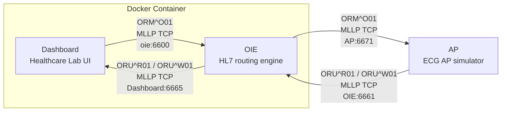
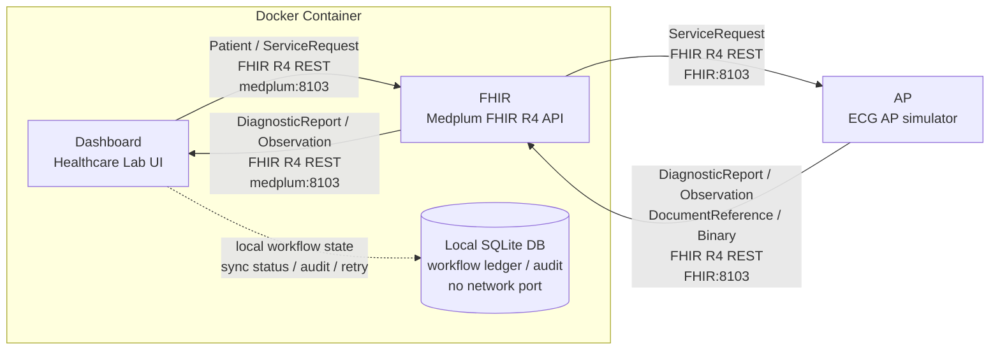

# Healthcare Lab Simple Workflows

These diagrams use the same structure for meeting presentation:

- Docker Container: Dashboard + integration service
- External: AP
- Arrows show payload/resource type and port
- Dashboard local database is shown only where it matters

## OIE Workflow

## FHIR Workflow

